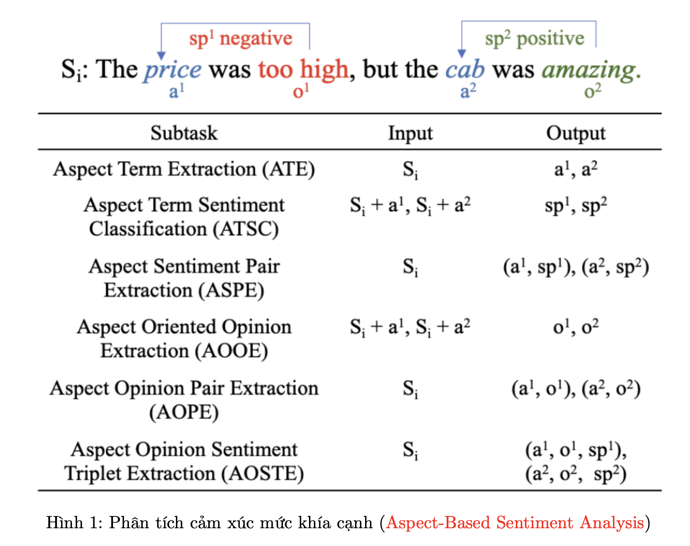

##  Aspect-Based Sentiment Analysis

#### Giới thiệu về project  Aspect-Based Sentiment Analysis :

Phân tích cảm xúc mức khía cạnh (Aspect-Based Sentiment Analysis) là bài toán có nhiều ứng dụng hiện nay trong việc phân tích các khía cạnh khác nhau của các bình luận, đánh giá về các sản phẩm, dịch vụ,... Ví dụ mình hoạ được minh hoạ như hình 1, với câu đầu vào: "The price was too high, but the cab was amazing.". Trong câu này, có hai khía cạnh được đánh giá là: "price" và "amazing". Với khía cạnh "price" được đánh giá là "too high" nên sẽ là "negative" và với khía cạnh "positive" được đánh giá là "amazing" nên sẽ là "positive".

Dựa vào việc xác định các giá trị đầu ra của mô hình, chúng ta có thể có một số bài toán nhỏ hơn như sau:

1. Aspect Term Extraction (ATE) hoặc Aspect-Based Term Extraction: trích xuất các khía cạnh được đánh giá trong bình luận
2. Aspect Term Sentiment Classification (ATSC): dựa vào câu đầu vào và các khía cạnh được đánh giá trong bình luận để dự đoán cảm xúc của bình luận
3. Aspect Sentiment Pair Extraction (ASPE): dựa vào câu đầu vào, trính xuất ra khía cạnh và dự đoán cảm xúc của các khía cạnh
4. Aspect Oriented Opinion Extraction (AOOE): dựa vào câu đầu vào và khía cạnh, dự đoán đoạn văn bản thể hiện cảm xúc của khía cạnh
5. Aspect Opinion Pair Extraction (AOPE): dựa vào câu đầu vào trích xuất thông tin về khía cạnh và đoạn văn bản thể hiện cảm xúc của khía cạnh
6. Aspect Opinion Sentiment Triplet Extraction (AOSTE): dựa vào câu đầu vào, trích xuất các thông tin về khía cạnh, đoạn văn bản thể hiện cảm xúc của khía cạnh và cảm xúc của khía cạnh trong bình luận

Trong phần này, chúng ta sẽ xây dựng mô hình giải quyết vấn đề cho bài toán ASPE. Dựa vào 2 bước chính:
1. Bước 1: Dự đoán từ trong văn bản thể hiện khía cạnh, hay chính là bài toán ATE
2. Bước 2: Dựa vào văn bản đầu vào và vị trí từ thể hiện khía cạnh dự đoán cảm xúc cho khía cạnh, hay là bài toán ATSC

#### Cài đặt chương trình

**Dataset** : [SemEval-2014 Task 4: Aspect Based Sentiment Analysis](https://aclanthology.org/S14-2004/)

##### Giai đoạn 1 : ATE

Ở trong phần này, chúng ta xây dựng mô hình ATE dựa vào các phương pháp giải quyết bài toán sequence classification được sử dụng trong POS Tagging, NER,...

+ Model
    + Dựa trên BERT
    + Loss Function : CrossEntropy

##### Giai đoạn 2 : ATSC

Trong gia đoạn 1, chúng ta đã tính được từ là khía cạnh trong văn bản đầu vào, ở phần này, chúng ta xây dựng mô hình dựa vào câu đầu vào và khía cạnh được dự đoán xây dựng mô hình dự đoán cảm xúc.

+ Input đầu vào là Sentence và Aspect ngăn cách với nhau bằng token `<SEP>`
    + Example input : ['[CLS]',
                        'the',
                        'bread',
                        'is',
                        'top',
                        'notch',
                        'as',
                        'well',
                        '[SEP]',
                        'bread']

