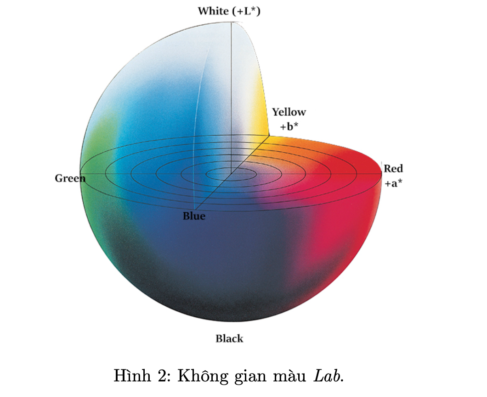

## Diffusion-based Image Colorization

#### Giới thiệu về project Diffusion-based Image Colorization :

Sự bùng nổ của mô hình Diffusion trong những năm gần đây đã tạo ra nhiều bước ngoặt trong vấn đề sinh dữ liệu, đặc biệt là vấn đề tái tạo ảnh. Theo đó, ở quá trình forward, Diffusion thêm nhiễu vào ảnh một cách có hệ thống, biến ảnh thành một nhiễu tuân theo phân phối Gauss. Sau đó, ở quá trình ngược lại, mô hình này học cách dự đoán nhiễu và tiến hành khử nhiễu dần dần từ một nhiễu chuẩn để tạo ra ảnh mới.

Trong bài báo mang tên Palette: Image-to-Image Diffusion Models, mô hình Diffusion đã thực sự chứng minh được khả năng tổng quát mạnh mẽ của mình, khi cùng lúc giải quyết 4 vấn đề khó trong lĩnh vực dịch ảnh chỉ với một mô hình duy nhất, bao gồm: Colorization, Inpainting, Uncropping, và JPEG restoration.

Trong dự án này, chúng ta sẽ cùng tìm hiểu ứng dụng của mô hình Diffusion trong bài toán tô màu ảnh, bằng cách sử dụng những ý tưởng cơ bản của công bố nêu trên.

Image Colorization là quá trình dự đoán màu cho các ảnh đen trắng, giúp tái tạo lại hình ảnh thực tế từ dữ liệu đơn sắc, mang lại trải nghiệm hình ảnh phong phú và sống động. Với đầu vào là một ảnh xám, biểu thị cường độ sáng của ảnh, mô hình sẽ học cách ước tính các kênh màu của ảnh, tạo ra một hình ảnh hợp lý và hài hòa về mặt thị giác.

Trong dự án này, chúng ta sẽ tiếp tục sử dụng không gian màu Lab cho xử lý dữ liệu. Theo đó, mô hình của chúng ta sẽ nhận đầu vào là kênh L như tấm ảnh gray-scale, đại diện cho độ sáng, và sử dụng kênh ab như ground truth của mô hình.

Đối với vấn đề tô màu cho ảnh, có một thuật ngữ được gọi là Multimodal Predictions. Thuật ngữ này đề cập đến việc một pixel có thể có nhiều kết quả màu hợp lý thay vì chỉ một dự đoán nhất định. Điều này dẫn đến việc, để đánh giá một mô hình Image Colorization, ta không chỉ sử dụng thước đo định lượng, mà cần phải xem xét đến cảm nhận thị giác và những kết quả mang tính định tính khác.

Một thước đo định tính đã và đang được sử dụng để giải quyết vấn đề này được gọi là colorization Turing test (hay Fool rate). Theo đó, người tham gia sẽ cần phải phân biệt những tấm ảnh gốc và những tấm ảnh giả được tạo ra từ mô hình AI. Tỷ lệ người tham gia bị đánh lừa bởi mức độ chân thật của ảnh giả càng cao, chứng tỏ mô hình thu được càng tốt.

Chính vì vậy, cần thiết phải có một công cụ giúp người huấn luyện có thể quan sát một cách trực quan những kết quả hình ảnh được tạo ra trong quá trình huấn luyện một mô hình Image Colorization. Thật may mắn, Weights & Biases (wandb), một công cụ cho phép theo dõi và hiển thị kết quả số liệu, hình ảnh, đã và đang ngày càng phổ biến và dễ sử dụng.

Trong phần này, chúng ta sẽ tập trung vào việc xây dựng một mô hình dựa trên Diffusion để giải quyết vấn đề Image Colorization, cùng với đó là áp dụng công cụ wandb để hỗ trợ quá trình huấn luyện. Input và output của chương trình như sau:

1. Input: Ảnh xám G (L channel).

2. Output: Trường ảnh màu C (ab channels).

#### Cài đặt chương trình
1. Dataset : [CelebA Dataset](https://mmlab.ie.cuhk.edu.hk/projects/CelebA.html)

2. Data Preparation : Chuẩn bị dữ liệu cho tập huấn luyện.

3. Model : Xây dựng mô hình UNet và mô hình Diffusion cho Colorization.

4. Loss, Metrics
    + Loss : MSE LOSS
    + Metrics : MAE

4. Metrics
    + IoU
    + Accuracy Score