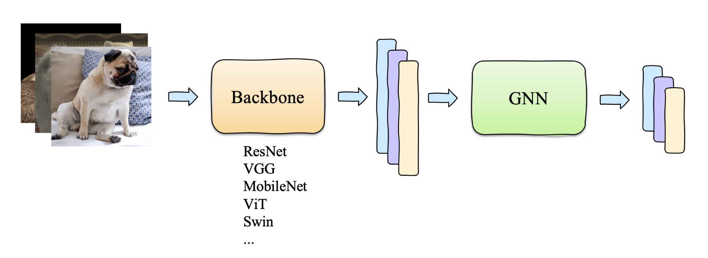
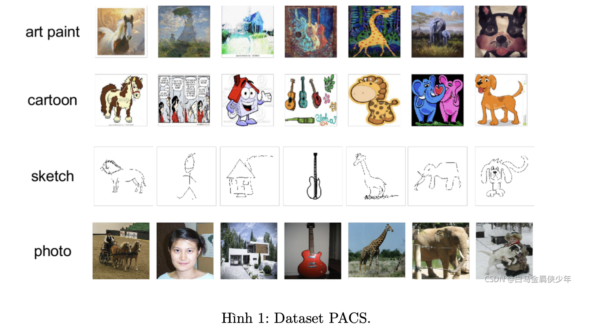

## Graph Convolution Network

#### Giới thiệu về project Graph Convolution Network :

Graph Neural Network - GNN là một nerual network sử dụng để xử lý dữ liệu được biểu diễn dưới dạng graph. Trong graph, các đỉnh (node) biểu diễn các thực thể, và các cạnh (edge) thể hiện các mối quan hệ giữa các node. GNN được thiết kế để trích xuất thông tin từ cấu trúc graph để thực hiện các bài toán như classification, prediction, clustering, và labeling graph data.

Đặc điểm chính của GNN là khả năng tổng hợp thông tin từ các node lân cận trong graph. Mỗi node trong graph có thể được xem như một feature vector, và GNN sử dụng các cơ chế lan truyền thông tin qua các edge để cập nhật các vector này. Quá trình này thường được thực hiện qua nhiều layer của network, mỗi layer thực hiện một bước lan truyền và cập nhật thông tin.

GNN có hiệu suất mạnh mẽ trong nhiều ứng dụng thực tế, bao gồm social network analysis, predicting molecular interactions, graph image classification, và nhiều tác vụ khác.

#### Nội dung

GNN hoạt động bằng cách tổng hợp thông tin từ các node có liên quan với nhau (có edge), trong các dataset dành riêng cho GNN (ví dụ Cora, Citeseer, Pubmed,...), các edge được đã được định nghĩa sẵn, điều này gây ra khó khăn khi sử dụng GNN vào các bài toán khác (ví dụ image classification, object detection,...).

Để có thể sử dụng GNN vào các bài toán bất kì, ta cần trả lời tuần tự 3 câu hỏi sau:

• Node là gì?

• Edge là gì?

• Ta có thể thêm hàm loss phụ trợ không?

Ba câu hỏi trên sẽ quyết định việc ta có thể sử dụng GNN vào một bài toán bất kì được hay không.

Tuy nhiên, để GNN có thể cải thiện performance của model hiện tại ta cần phải trả lời câu hỏi quan trọng sau:

• GNN sẽ hoạt động như thế nào?

Ta cần phải giải thích rõ cách GNN sẽ hoạt động trước khi tiến hành code thay vì hoàn thành 3
câu hỏi đầu tiên và cầu nguyện model sẽ chạy tốt.

#### Ý tưởng cho bài toán 

Để có thể sử dụng GNN cho bài toán image classification, ta cần trả phải trả lời 3 câu hỏi ở phần trên.

• Node: Ta có thể định nghĩa mỗi sample (image) là một node.

• Edge: Khi mỗi sample là một node thì edge chính là liên kết giữa 2 sample khi 2 sample đó có cùng class. Nếu 2 sample không cùng class thì sẽ không có edge.

• Hàm loss phụ trợ: Trong các bài toán mà các edge được định nghĩa rõ ràng (ví dụ trong bài này là cùng class với nhau) thì thêm hàm loss phụ trợ chắc chắn sẽ tăng performance so với không thêm.

Sau khi đã trả lời được 3 câu hỏi trên thì ta đã chắc chắn rằng đã có thể triển khai code. Tuy nhiên, ta cần phải giải thích vai trò của GNN là gì trong model mới này.

Ta thấy, trong 1 batch data sẽ có nhiều sample có cùng class, và trong các sample cùng class sẽ có các sample khó học và các sample dễ học. Ví dụ class về ghế sofa, các sample dễ học là các sample mà trong đó chỉ có mỗi ghế sofa, các sample khó học sẽ bao gồm ghế sofa và bàn gần vị trí đó. Việc này là hoàn toàn bình thường vì ghế sofa và bàn thường nằm cùng nhau trong nhà, nên khi chụp ảnh ghế thì sẽ dính phải bàn. Khi sử dụng GNN để tổng hợp thông tin từ các sample cùng class trong 1 batch thì ta sẽ dùng các sample dễ để “cung cấp” thông tin cho các sample khó, từ đó giúp model học tốt các sample khó và performance tổng quát của model sẽ được cải thiện.

Ta sẽ tăng độ khó của dataset trong bài toán này để thấy sự hiệu quả của GNN.

#### Dataset

**PACS Datasets**

PACS là một tập dữ liệu hình ảnh về domain generalization. PACS bao gồm 4 domain: photo (1.670 ảnh), art painting (2.048 ảnh), cartoon (2.344 ảnh) và sketch (3.929 ảnh). Mỗi domain bao gồm 7 class.

Điểm khó của PACS là việc sẽ có nhiều domain cho cùng 1 class, ví dụ trong class person sẽ có 4 domain (cột số 2 trong hình 1):

• Ảnh person được chụp từ thực tế (photo)

• Ảnh person được vẽ phác thảo (sketch)

• Ảnh person từ phim hoạt hình (cartoon) 

• Ảnh vẽ person (art painting)
Việc có nhiều domain cho cùng một class như vậy sẽ tăng độ khó của dataset, đòi hỏi model phải có khả năng generalize tốt hơn.

#### Image Classification

Ta sẽ định nghĩa model GNN trước khi tích hợp GNN vào model chính. GNN sẽ bao gồm 2 phần chính là Edge và Node network. Edge network sẽ làm nhiệm vụ edge prediction, cụ thể, ta sẽ dùng edge network để predict giữa 2 sample bất kì trong 1 batch có liên kết với nhau không. Ta cần dùng 1 model để predict edge giữa 2 sample bất kì và dùng hàm loss để giúp edge network predict tốt hơn. Nói cách khác, vì khi inference ta không có label nên không thể biết 2 sample bất kì có edge với nhau hay không, nên ta mới cần edge network làm nhiệm vụ edge prediction.

Node network sẽ dùng edge_feat để tổng hợp thông tin. Node network sẽ dùng các giá trị trong edge_feat để tổng hợp thông tin cho các sample, giá trị càng cao sẽ được tổng hợp càng nhiều, và ngược lại.
