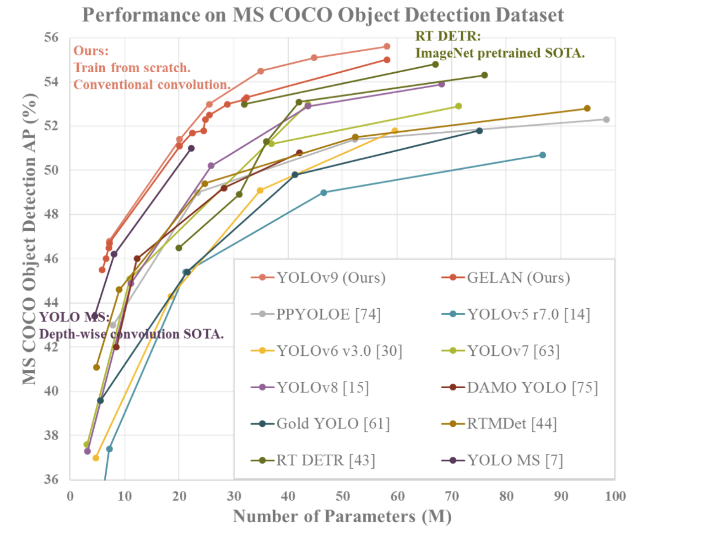

## HUMAN DETECTION YOLOv9

#### Giới thiệu về project HUMAN DETECTION YOLOv9 :

Phát hiện người là một bài toán quan trọng trong các lĩnh vực của thế giới hiện tại, đòi hỏi độ chính xác cao và thời gian xử lý nhanh. YOLOv9, phiên bản mới nhất trong chuỗi các mô hình YOLO nổi tiếng về khả năng phát hiện đối tượng nhanh và chính xác, là công cụ lý tưởng cho bài toán này.

Tổng Quan Mô Hình:

Cải Tiến Kỹ Thuật: YOLOv9 mang đến các cải tiến đáng kể so với các phiên bản trước, bao gồm Programmable Gradient Information (PGI) giúp giảm mất mát thông tin trong quá trình trích xuất đặc trưng và GELAN (Generalized Efficient Layer Aggregation Network) hỗ trợ tăng tốc độ xử lý mà vẫn đảm bảo độ chính xác.

Kiến Trúc Mạng: Mô hình kết hợp kiến trúc CSPNet và ELAN, tạo nên một mạng nơ-ron nhẹ nhưng mạnh mẽ, có thể thích ứng với nhiều loại đối tượng và điều kiện khác nhau, làm cho nó trở thành công cụ hoàn hảo cho nhiệm vụ phát hiện mũ bảo hiểm.

Phát Hiện Chính Xác: Với khả năng tổng quát hóa tốt, YOLOv9 có thể phát hiện mũ bảo hiểm trong nhiều điều kiện và góc độ khác nhau, từ đó tăng cường an toàn cho người lao động và người tham gia giao thông.
