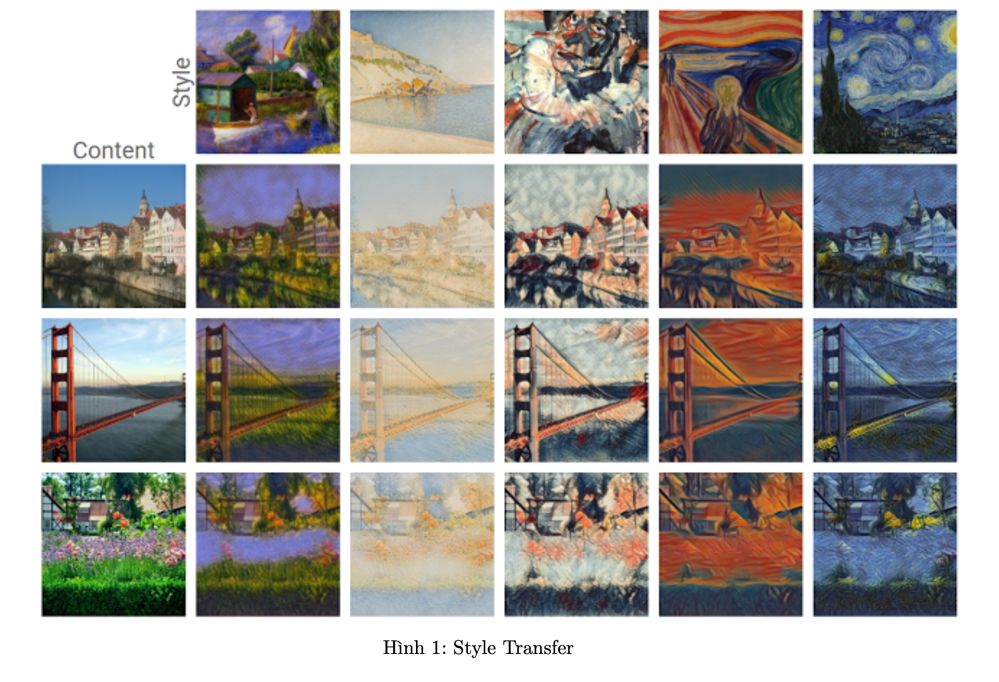
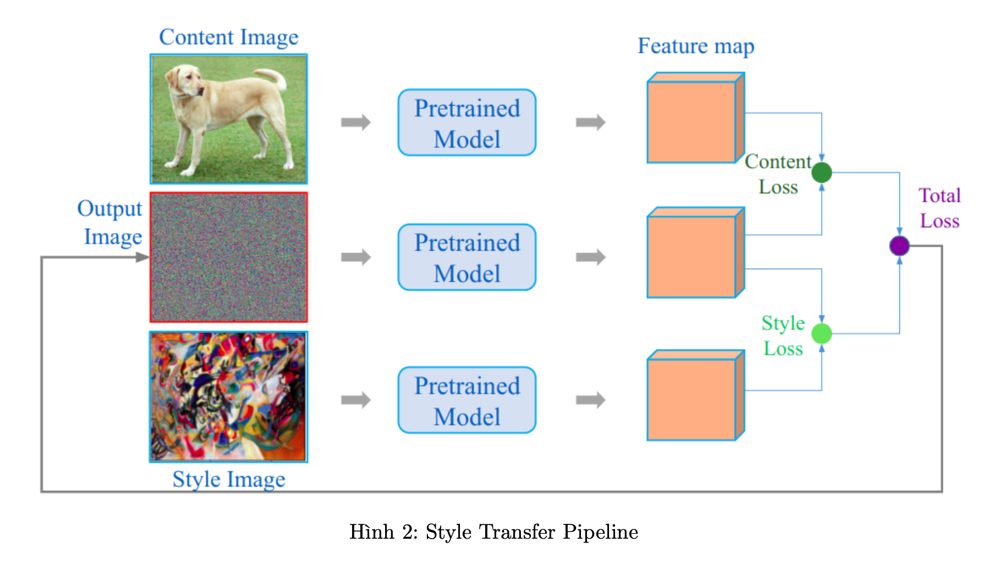
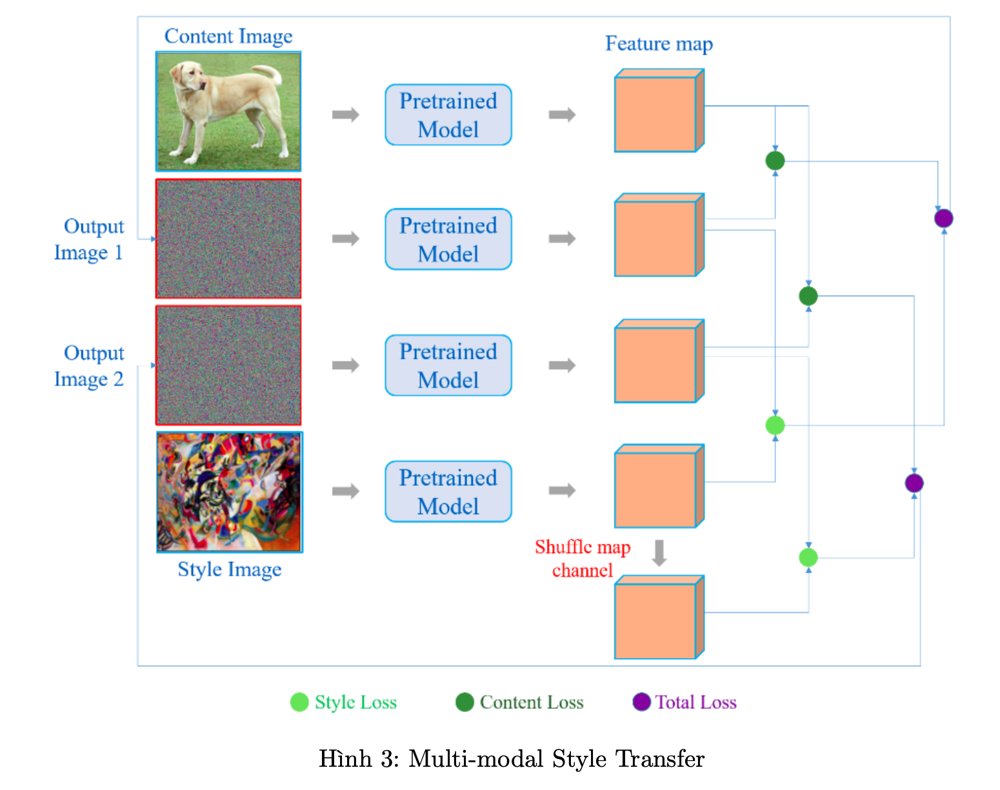
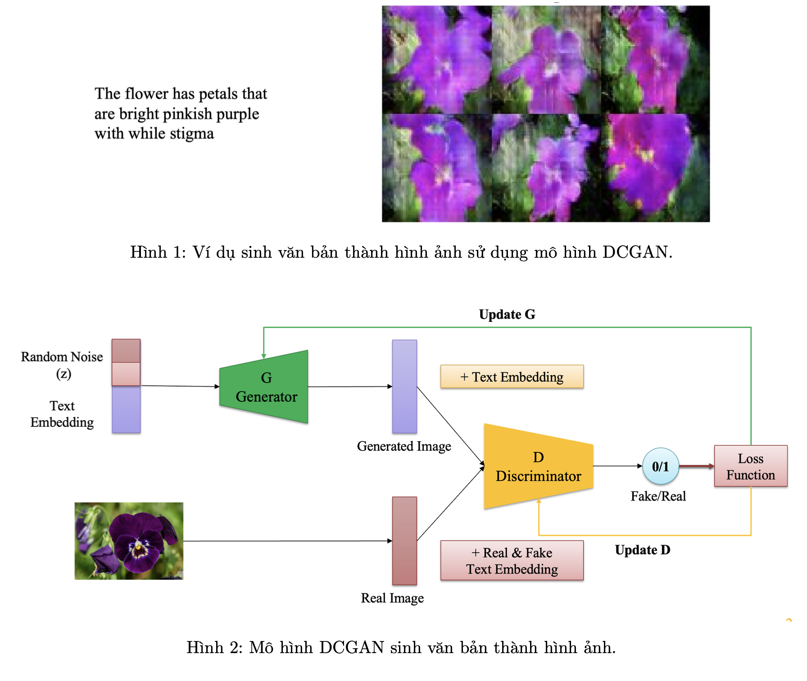
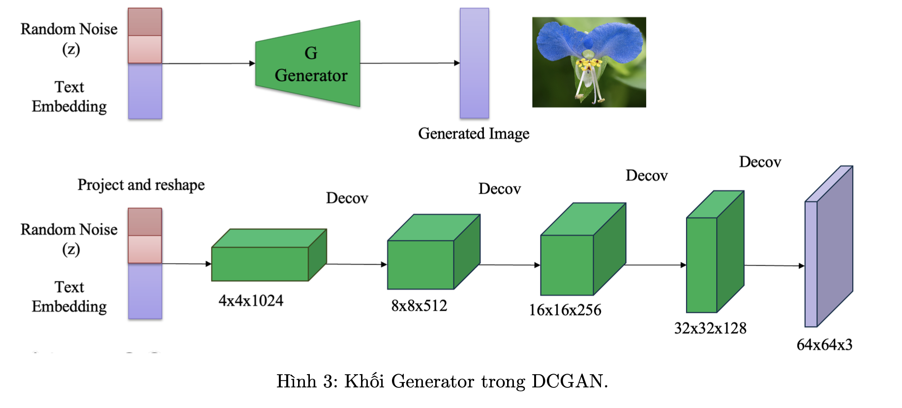
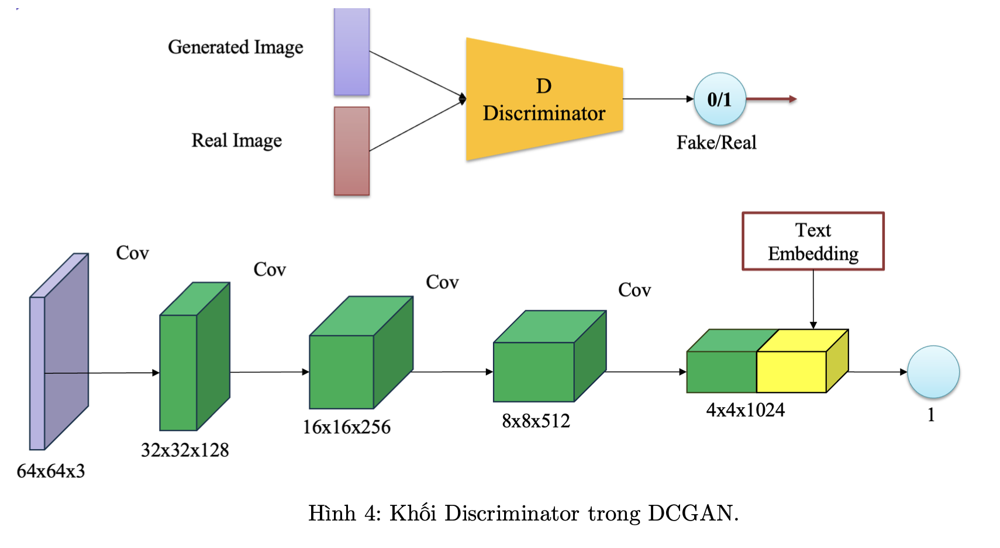
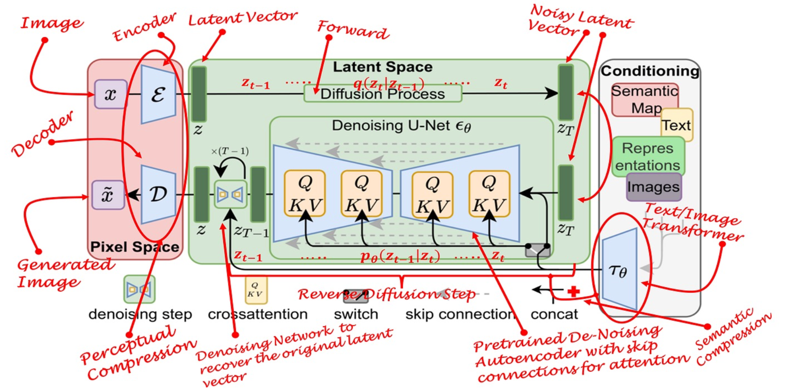

## Image Generation

### Giới thiệu về project Image Generation :

#### Style Transfer
`Style transfer` là sự kết hợp giữa trí tuệ nhân tạo và nghệ thuật (art), đây là lĩnh vực thú vị nơi mà thẩm mỹ của nghệ thuật hình ảnh được kết hợp với nội dung số hóa. Quá trình này bao gồm việc áp dụng style (phong cách) nghệ thuật từ một hình ảnh và áp dụng nó lên nội dung (content) của một hình ảnh khác, từ đó tạo ra một hình ảnh mới thể hiện bản chất của cả hai.

Bài toán này dựa trên việc sử dụng Mạng Nơ-ron Tích chập (CNNs), đặc biệt là các mạng được huấn luyện trước (pretrain) như VGGNet, có khả năng nắm bắt các đặc trưng của hình ảnh theo từng cấp bậc - từ các cạnh và kết cấu cơ bản đến các biểu diễn nội dung phức tạp hơn.

`Content Representation`: Nội dung (content) của một hình ảnh được học bởi feature map của một số layer trong mạng, thường là các lớp sâu hơn nơi mạng đã trừu tượng hóa khỏi dữ liệu pixel thô và thay vào đó biểu diễn các đặc điểm cấp cao hơn như hình dạng và đối tượng.

`Style Representation`: Phong cách (style) của một hình ảnh được học bởi các tương quan giữa các đặc điểm trong các layer khác nhau của mạng. Điều này được biểu diễn toán học bởi ma trận Gram, nắm bắt được phân phối của các đặc điểm. Ma trận Gram hoạt động như một biểu diễn thống kê về kết cấu và mẫu trong hình ảnh kiểu, cho phép chuyển các yếu tố phong cách mà không làm thay đổi cấu trúc nội dung của hình ảnh mục tiêu.

**Loss Function**

`Content Loss`: Đo lường mức độ nội dung của hình ảnh được tạo ra từ model sai lệch so với nội dung của hình ảnh nội dung gốc . Nó thường được tính toán bằng MSE của hình ảnh nội dung và hình ảnh được tạo ra trong một hoặc nhiều layer của CNN.

`Style Loss`: Đo lường sự khác biệt về phong cách giữa hình ảnh được tạo ra và hình ảnh tham khảo phong cách . MSE được sử dụng giữa các ma trận Gram của các biểu diễn phong cách của hình ảnh được tạo ra và hình ảnh phong cách qua nhiều layer của CNN.

`Total Loss`: Là hàm kết hợp content và style loss, thường là tổng hoặc kết hợp với các tham số để điều chỉnh lượng loss phù hợp

**Multi-modal Style Transfer**

Bằng cách biến đổi feature map củâ ảnh phong cách (style), ta có thể tạo ra nhiều phong cách khác nhau chỉ với một ảnh phong cách đầu vào

#### GANs

**Text to Image Synthesis**

Sinh hình ảnh từ văn bản hay tổng hợp văn bản thành hình ảnh (Text to Image) là bài toán ngày càng được ứng dụng manh mẽ trong lĩnh vực trí tuệ nhân tạo. Các mô hình được huấn luyện với đầu vào là đoạn văn bản và đầu ra là hình ảnh mô tả hoặc chứa các đối tượng được mô tả trong đoạn văn bản. Ví dụ về tổng hợp hình ảnh từ văn bản được mô tả trong Hình 1.

Hiện nay, có nhiều mô hình có thể xây dựng và giải quyết bài toán này có thể kể đến như GANs, Dif- fusion Models,... Ở trong phần này chúng ta sẽ sử dụng mô hình DCGAN (Deep Convolution Generative Adversarial Networks) để huấn luyện mô hình giải quyết bài toán này.

Mô hình DCGAN gồm 2 mạng là Generator và Discriminator. Trong đó:

1. Generator: Bao gồm các lớp mạng CNN nhận đầu vào là Noise (z) và Text Embedding (e - Biểu diễn của đoạn văn bản đầu vào). Đầu ra của khối Generator là ma trận ảnh được sinh ra G(z, e).

2. Discriminator: Bao gồm các lớp mạng CNN nhận đầu vào là biểu diễn của ảnh (ảnh thật hoặc ảnh fake được sinh ra từ khối Generator) sau đó kết hợp với Text Embedding để dự đoán ảnh thật hay ảnh fake.

#### Cài đặt chương trình : 

1. Dataset 
    + Ảnh : [Flower Dataset](https://www.robots.ox.ac.uk/~vgg/data/flowers/102/)
    + Đoạn mô tả hình ảnh : [Flower Description](https://drive.google.com/file/d/0B0ywwgffWnLLcms2WWJQRFNSWXM/view?resourcekey=0-Av8zFbeDDvNcF1sSjDR32w)
    + Text Embedding : [Here](https://drive.google.com/file/d/0B0ywwgffWnLLMl9uOU91MV80cVU/view?resourcekey=0-vy4hVV-6Hvpw3AiYipoa3g)

2. Xây dựng mô hình

    **Generator**

    Khối Generator sinh ra ảnh từ văn bản đầu vào:

    (a) Input: Nhận đầu vào là vector: Random Noise (z) có kích thước R, được nối với Vector Embedding (Vector e - biểu diễn cho cả đoạn văn bản đầu vào) có kích thước là D. Vì vậy, vector đầu vào mạng Generator là R + D.

    (b) Output: Sau khi học mối quan hệ để sinh ảnh, giá trị đầu ra của Generator sẽ là biểu diễn các điểm ảnh dự đoán trong không gian 3 chiều có kích thước là Channel x Width x Height (Ví dụ, CxWxH - 3x64x64)
    

    **Discriminator**

    Khối Discriminator dự đoán hình ảnh Fake/Real, bao gồm các lớp CNN với:

    (a) Input: Nhận đầu vào là ma trận điểm ảnh và Text Embedding. Ma trận điểm ảnh (CxHxW) sau khi qua các lớp CNN để học các đặc trưng của ảnh đầu vào sẽ được nối với vector embedding.

    (b) Output: Vector sau khi được nối sẽ được sử dụng để dự đoán 0(Fake) hoặc 1(Real).

    

    **Advanced**
    
    + Kết hợp mô hình BERT để làm giàu ngữ cảnh hơn thông qua cách biễu diễn vectors

3. Loss, Metrics
    + Loss : Kết hợp nhiều Loss cho Discriminator và Generator : MSE, L1, CrossEntropy Loss
    + Metrics : CLIP Score ...

#### Stable Diffusion

Mô Tả Dự Án: Sinh Hình Ảnh Từ Văn Bản Sử Dụng Mô Hình Stable Diffusion

Sinh hình ảnh từ văn bản là ứng dụng ngày càng phát triển trong lĩnh vực trí tuệ nhân tạo, liên quan đến quá trình tạo ra hình ảnh dựa trên các mô tả văn bản. Quá trình này, thiết yếu cho cả ứng dụng thực tế và sáng tạo, bao gồm các mô hình được huấn luyện để chuyển đổi đầu vào văn bản thành hình ảnh phù hợp và đúng ngữ cảnh.

Trong dự án này, ta sẽ tận dụng khả năng của mô hình `Stable Diffusion`, một loại mô hình khuếch tán, rất phù hợp cho việc tạo hình ảnh chất lượng cao và hiệu quả tính toán. Khác với các phương pháp dựa trên GAN truyền thống sử dụng cơ chế sinh và phân biệt, Stable Diffusion hoạt động trong một `latent space`.

Tổng Quan Mô Hình:

+ Diffusion Process: Mô hình Stable Diffusion sử dụng quá trình denoise biến đổi nhiễu thành hình ảnh chi tiết trong latent space. Điều này được thực hiện thông qua một chuỗi các bước tẩy nhiễu dần dần, được điều khiển bởi điều kiện, trong trường hợp này là đầu vào văn bản.

+ Encoder và Decoder: Ban đầu, Encoder chuyển đổi hình ảnh đầu vào thành latent representation. Trong quá trình sinh hình ảnh, mô hình thực hiện reverse diffusion bắt đầu từ nhiễu, điều kiện bởi mô tả văn bản được encode để đảm bảo sự liên quan đến văn bản đầu vào.

+ Conditional Generation: Mô hình điều kiện  denoising process trên các mô tả văn bản, sử dụng các nhúng từ các mô hình như BERT hoặc CLIP để đảm bảo hình ảnh được sinh ra phù hợp chặt chẽ với nội dung văn bản.

+ Hiệu Quả: Bằng cách hoạt động trong latent space thay vì trực tiếp trong pixel space, Stable Diffusion giảm đáng kể yêu cầu về tính toán, cho phép sinh hình ảnh nhanh hơn mà không làm giảm chất lượng hình ảnh.

**Optional**

+ Áp dụng các kĩ thuật PEFT : LoRA, QLoRA,.. để thực hiện hiệu quả trong quá trình huấn luyện

#### Cài đặt chương trình 

1. Dataset : []