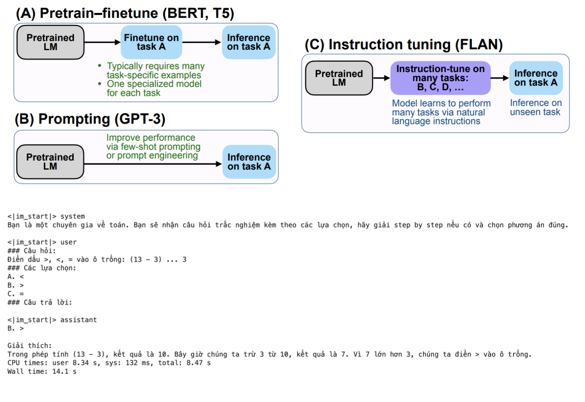

## LLM Math Solver

### Giới thiệu về project LLM Math Solver:

`LLM Math Solver` là một bài toán ứng dụng các mô hình Ngôn Ngữ Lớn (Large Language Models - LLMs) để giải quyết các bài toán toán học dạng trắc nghiệm. Các mô hình này được huấn luyện để không chỉ nhận diện và xử lý các câu hỏi toán học mà còn cung cấp lời giải chi tiết và lựa chọn câu trả lời chính xác. Dự án này tận dụng sức mạnh của việc học trong bối cảnh (in-context learning) và điều chỉnh hướng dẫn (instruction tuning) để tăng cường khả năng của LLMs trong việc hiểu và thực hiện các nhiệm vụ giải toán phức tạp.

Trong dự án này, chúng ta sẽ phát triển một chương trình có khả năng:

+ Input: Câu hỏi toán dạng trắc nghiệm với các lựa chọn đáp án.

+ Output: Đáp án chính xác cùng với lời giải chi tiết cho từng bước tính toán nếu có.

