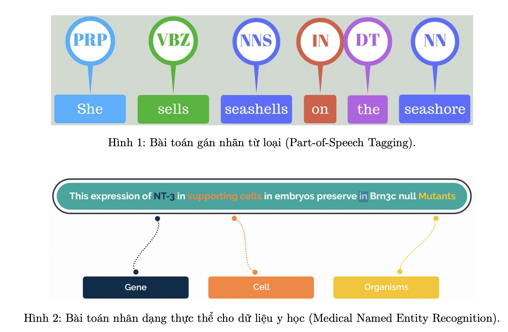
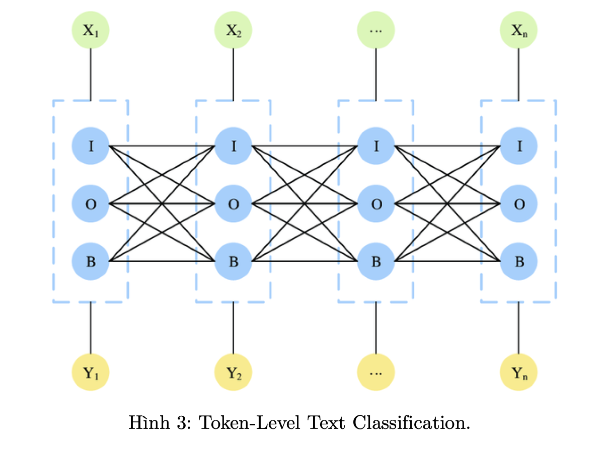
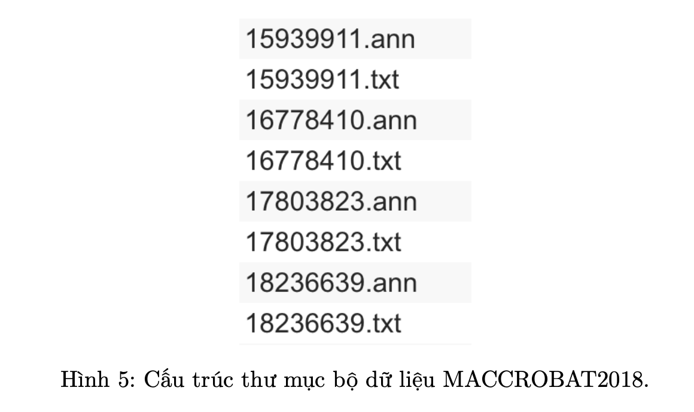

## Medical Data Analysis

#### Giới thiệu về project Medical Data Analysis :

`Part-of-Speech (POS) Tagging` (Gán nhãn từ loại): là bài toán gán nhãn các từ trong câu tương ứng với từ loại thực hiện chức năng ngữ pháp của nó. Các từ loại được xây dựng và mở rộng phụ thuộc vào đặc trưng ngôn ngữ. Trong đó, một số từ loại điển hình thường xuất hiện trong hầu hết các ngôn ngữ trên thế giới hiện nay như: danh từ (Noun), tính từ (Adjective), động từ (Verb),... Ngoài các từ loại phổ biến này ra, dựa vào đặc trưng ngôn ngữ có thể xác định được tập các từ loại nhỏ hơn. Ví dụ với động từ trong tiếng anh (VERB) có thể phân chia thành: VB (Verb, base form - động từ nguyên thể), VBD (Verb, past tense - động từ quá khứ),... hoặc danh từ trong tiếng anh (NOUN) có thể được phân chia thành: NN (Noun, singular or mass - Danh từ số ít), NNS (Noun, plural - Danh từ số nhiều),... Để hiểu rõ thêm về tập nhãn từ loại, các chuyên gia thường xây dựng và thống nhất cho các ngôn ngữ khác nhau, tập nhãn từ loại cơ bản thường là tập nhãn Penn Tree Bank. Ví dụ về POS Tagging được minh hoạ trong hình 1. Với câu đầu vào: "She sells seashells on the seashore", thông qua các mô hình gán nhãn sẽ gán nhãn từ loại cho các từ thành: "She" có nhãn từ loại là "PRP-Personal pronoun", "sells" có nhãn từ loại là "VBZ-Verb, 3rd person singular present",... đến "seashore" có nhãn từ loại là "NN-Noun, singular or mass".

`Named Entity Recognition (NER - Nhận dạng thực thể)`: là bài toán xác định từ hoặc chuỗi từ trong văn bản là tên của một thực thể xác định, các thực thể điển hình như: tên người, tên địa danh, giới tính,... NER là bài toán có nhiều ứng dụng trong trích xuất các thông tin quan trọng thuộc nhiều lĩnh vực khác nhau. Đặc biệt là việc khai thác và trích xuất thông tin trong các bản ghi hồ sơ bệnh lĩnh vực y học (Medical NER). Ví dụ về Medical NER được minh hoạ trong hình 2. Với đoạn văn bản đầu vào: "This expression of NT-3 in supporting cells in embryos preserve in Brn3c null Mutants" thông qua mô hình nhận dạng thực thể sẽ xác định và trích xuất các thông tin quan trọng như: "NT-3" sẽ là thực thể "Gene", "supporting cells" sẽ là thực thể "Cell" và "Mutants" sẽ có thực thể là "Mutants".

Bài toán POS Tagging và NER thuộc nhóm bài toán phân loại mức từ (Token-level Text Classifica- tion). Nghĩa là với mỗi đơn vị văn bản đầu vào (các từ) sẽ được phân loại vào một lớp cụ thể (từ loại: danh từ, động từ,... trong bài POS Tagging hoặc thực thể trong bài NER)

#### Cài đặt chương trình
##### POS Tagging

1. Dataset : Penn Tree Bank Dataset từ thư viện `nltk`

2. Preprocessing

3. Modeling
    + `QCRI/bert-base-multilingual-cased-pos-english`
4. Metrics 
    + Accuracy

##### Medical NER

Mô tả bài toán :

Quay trở lại với ví dụ ở hình 2. 

Với đoạn văn bản đầu vào: "This expression of NT-3 in supporting cells in embryos preserve in Brn3c null Mutants" thông qua mô hình gán nhãn thực thể sẽ xác định và trích xuất các thông tin quan trọng như: "NT-3" sẽ là thực thể "Gene", "supporting cells" sẽ là thực thể "Cell" và "Mutants" sẽ có thực thể là "Mutants". Vì vậy, kết quả của mô hình sẽ có những từ không thuộc vào thực thể nào hoặc một thực thể có thể chứa nhiều từ. Nhưng mô hình giải quyết cho bài toán Token-Level Text Classification sẽ gán nhãn cho mỗi từ (hoặc gọi là token) thuộc vào một nhãn cụ thể. Cho nên, để giải quyết vấn đề này, chúng ta tần xây dựng một tập nhãn mới và quy bài toán NER về thành chuẩn bài toán Token-Level Text Classification.
Tập nhãn mới được xác định gồm:

1. Với những từ không thuộc vào thực thể nào sẽ được gán nhãn thành nhãn: "O"
2. Với những thực thể có thể có một hoặc nhiều từ đi kèm, chúng ta tạo ra tập nhãn BI (hoặc I, BIE). Ví dụ, thực thể "Cell" sẽ tạo thành tập nhãn bao gồm: "B-Cell" (Xác định vị trí từ bắt đầu của thực thể), "I-Cell" (Xác định vị trí của các từ theo sau vị trí bắt đầu thực thể) hoặc có thêm "E-Cell" (Xác định vị trí kết thúc của thực thể).
Vì vậy chúng ta có các phương pháp xác định tập nhãn mới có thể là BIO, hoặc IO, hoặc BIOE.
Vì vậy với bộ dữ liệu với N thực thể, chúng ta sẽ tạo thành bộ nhãn mới gồm: 2*N (Nhãn B và I cho mỗi thực thể) + 1 (tương ứng nhãn O). Ví dụ với câu trên có 3 thực thể "Gene", "Cell", "Mutants" sẽ tạo thành 7 nhãn mới: "B-Gene", "I-Gene", "B-Cell", "I-Cell", "B-Mutants", "I-Mutants" và "O".
Do đó, bài toán chuyển thành, với đoạn văn bản đầu vào: "This expression of NT-3 in supporting cells in embryos preserve in Brn3c null Mutants" sẽ được gán nhãn thành: "O O O B-Gene O B-Cell I-Cell O O O O O O B-Mutants". Vì vậy, chúng ta sẽ quy về bài toán Token-Level Text Classification và xây dựng mô hình tương tự như bài toán POS Tagging.
Tiếp theo, chúng ta sẽ xây dựng mô hình dựa trên pre-trained model như BERT,... sau khi đã tải về bộ dữ liệu MACCROBAT2018.

Dataset : [MACCROBAT2018](https://figshare.com/articles/dataset/MACCROBAT2018/9764942)

Mỗi sample tương ứng gồm 2 file: các file có đuôi "...txt", chứa đoạn văn bản và các file có đuôi"...ann" chứa các nhãn thực thể tương ứng được mô tả theo chuẩn `BioNLP Shared Task standoff format` được mô tả cụ thể như hình sau:

Với cột đầu tiên: T đại diện cho Entity, E đại diện cho Event và R đại diện cho Relation. Vì vậy, trong bài toán Medical NER chúng ta sẽ sử dụng các nhãn T.

Tương ứng với các thực thể T sẽ có cột thứ 2 là tên thực thể, ví dụ Organization, cột thứ 3 sẽ là vị trí trong văn bản đầu vào lấy từ file có đuôi ".txt", cột thứ 4 sẽ là đoạn văn bản tương ứng.

**Preprocessing**
    + Xử lý các file đầu vào theo cấu trúc

**Modeling**

+ `d4data/biomedical-ner-all`

**Metrics**

+ Acccuracy