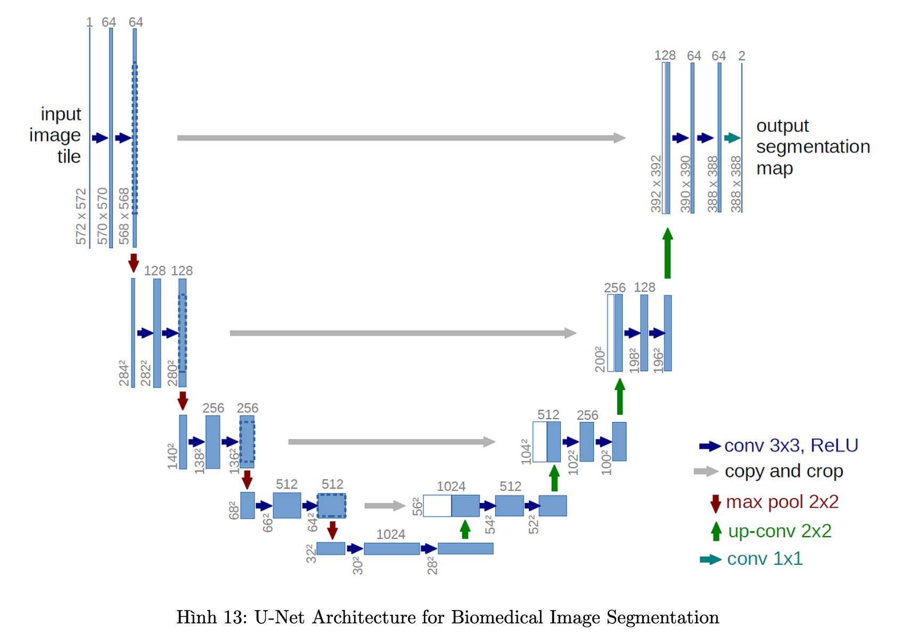

## Medical Image Analysis

#### Giới thiệu về project Medical Image Analysis :

1. Tổng quan về xử lý ảnh y tế 

    1.1 (Digital Image Processing - DIP)

        Trong lĩnh vực xử lý ảnh, định dạng 8-bit đang trở thành xu hướng phổ biến nhất, được sử dụng rộng rãi trong các ứng dụng liên quan đến thị giác và kinh doanh. Đối với nhiều nhiệm vụ trong Lĩnh vực Thị giác Máy tính, hầu hết mọi thứ xoay quanh việc xử lý ảnh 8-bit, trừ những trường hợp đặc biệt như hình ảnh y tế DICOM với định dạng 12-bit và một số nhiệm vụ chuyên ngành khác.

        Việc sử dụng định dạng 8-bit không chỉ mang lại hiệu suất tốt cho con người trong việc nhận diện và xử lý hình ảnh mà còn đáp ứng đầy đủ nhu cầu trong các lĩnh vực thương mại. Trong khi đó, những ứng dụng y tế và một số nhiệm vụ chuyên ngành sử dụng định dạng 12-bit để đảm bảo chất lượng hình ảnh cao và độ chính xác trong chuẩn đoán và phân tích.

    

    1.2 Phép toán biến đổi điểm (Pixel value transformation)

        Pixel value transformation được chia làm 3 loại chính:

            • Phép biến đổi đơn lẻ (Isolated transformation) - Toán tử điểm của ảnh trên một ảnh: Đọc giá trị một điểm ảnh và thay thế bằng giá trị khác.
            Ví dụ: tăng cường độ tương phản, cân bằng histogram.
            • Phép biến đổi cục bộ (Local transformation): Đọc giá trị nhiều điểm lân cận và tính toán giá trị mới cho một điểm ảnh.
            Ví dụ: Convolutional, Correlation,...
            • Phép biến đổi toàn cục (Global transformation): Đọc giá trị tất cả các điểm ảnh của một ảnh và tính toán giá trị mới cho một điểm ảnh
            Ví dụ: FFT,...

    

    1.3 Brightness

        Trung bình độ sáng của tất cả các pixel trong một hình ảnh thường được sử dụng để đánh giá mức độ sáng tổng thể của hình ảnh. Để tính trung bình độ sáng này, ta cộng tổng giá trị sáng của tất cả các pixel rồi chia cho tổng số pixel trong hình ảnh. Kết quả này có thể giúp biểu diễn mức độ chung của sáng tối trong hình ảnh.

        Đồng thời, để biểu thị mức độ sáng và tối của hình ảnh, ta có thể sử dụng giá trị trung bình tính được. Nếu giá trị trung bình gần 0, hình ảnh có thể được coi là tối, trong khi giá trị trung bình gần giá trị tối đa (ví dụ, 255 trong trường hợp hình ảnh 8-bit) thì hình ảnh có thể được coi là sáng.

    

    1.4 Contrast

        Để đánh giá độ tương phản trong một hình ảnh, ta thường sử dụng độ lệch chuẩn (standard deviation) của các giá trị sáng. Độ lệch chuẩn này đo lường sự biến động, đồng thời cho biết mức độ chênh lệch giữa các giá trị sáng khác nhau. Càng cao độ lệch chuẩn, hình ảnh có độ tương phản cao hơn.

    

        Ngoài ra, sự chênh lệch giữa giá trị sáng tối đa và giá trị sáng tối thiểu cũng là một cách đo lường độ tương phản. Bằng cách tính hiệu giữa giá trị sáng tối đa và tối thiểu, ta có thể biểu diễn khoảng chênh lệch giữa các giá trị sáng trong hình ảnh. Điều này mang lại thông tin về phổ của giá trị sáng, từ sáng nhất đến tối nhất.
    
    

    1.5 Histogram

        Biểu đồ histogram là một đồ thị biểu diễn tần suất xuất hiện của các giá trị sáng trong một hình ảnh. Trục ngang của histogram biểu thị giá trị sáng (thường từ 0 đến 255 trong ảnh 8-bit), trong khi trục đứng biểu thị số lượng pixel có giá trị sáng tương ứng. Histogram cung cấp cái nhìn tổng quan về phân phối của các mức độ sáng trong hình ảnh.

        Thông qua histogram, ta có thể rút ra những thông tin quan trọng về hình ảnh:

            • Độ tương phản (Contrast): Histogram giúp đánh giá mức độ tương phản bằng cách quan sát khoảng cách giữa các đỉnh và đáy của histogram. Nếu histogram có nhiều giá trị tập trung ở các phạm vi sáng và tối, hình ảnh có độ tương phản cao.
            • Độ sáng trung bình: Histogram cung cấp thông tin về giá trị sáng trung bình của hình ảnh. Nếu giá trị sáng trung bình nằm ở phía trái trục x, hình ảnh có thể được coi là tối, ngược lại nếu nằm ở phía phải, hình ảnh sáng hơn.
            • Phân phối sáng tối: Bằng cách xem xét histogram, ta có thể đánh giá xem hình ảnh có xu hướng chủ yếu ở phạm vi sáng, tối, hoặc trung bình.

    

    1.6 Cân bằng độ tương phản (Histogram Equalization)

        Cân bằng histogram là một kỹ thuật trong xử lý ảnh để làm cho phân phối giá trị sáng trên hình ảnh trở nên đồng đều, thay vì giữ nguyên đặc điểm phân phối ban đầu. Ý tưởng chính của cân bằng histogram là tăng cường độ tương phản và làm cho hình ảnh trở nên trực quan hơn.

        Khi thực hiện cân bằng histogram, ta điều chỉnh giá trị sáng của các pixel để tạo ra một histogram gần như là phân phối đồng đều. Quá trình này giúp đồng đều hóa các mức độ sáng trên hình ảnh và tăng cường độ tương phản.
        
        Kết quả của cân bằng histogram thường là một hình ảnh với histogram gần như là một đường thẳng đứng, biểu thị rằng mọi giá trị sáng xuất hiện với tần suất tương đương. Điều này có thể giúp làm nổi bật chi tiết và cải thiện chất lượng của hình ảnh, đặc biệt là trong trường hợp các khu vực có độ tương phản thấp.

    

        Công thức cân bằng histogram (Histogram Equalization) : (https://viblo.asia/p/tuan-3-histogram-histogram-equalization-3P0lPnxmKox)

        Quá trình này làm thay đổi giá trị sáng của từng pixel sao cho histogram của hình ảnh sau khi cân bằng trở nên đồng đều hơn. Kết quả là cải thiện độ tương phản và đồng đều hóa mức độ sáng trên toàn bức ảnh.

    1.7 Cân bằng độ tương phản CLAHE

        CLAHE (Contrast Limited Adaptive Histogram Equalization) là một phương pháp cải thiện của phép cân bằng histogram (Histogram Equalization). Điều đặc biệt về CLAHE là nó áp dụng cân bằng his- togram dựa trên các khu vực nhỏ (local neighborhoods) trong hình ảnh thay vì trên toàn bức ảnh. Điều này giúp giảm nguy cơ xuất hiện hiệu ứng "over-enhancement" (quá tăng cường) và duy trì chi tiết cục bộ.

        Mô tả chi tiết về CLAHE:

            • Chia hình ảnh thành các ô nhỏ (tiles): Hình ảnh được chia thành các ô nhỏ, thường được gọi là "tiles". Mỗi ô nhỏ này là một phần nhỏ của hình ảnh.

            • Áp dụng Histogram Equalization cho từng ô nhỏ: Đối với mỗi ô nhỏ, phép cân bằng histogram được áp dụng độc lập. Điều này có nghĩa là mỗi khu vực nhỏ của hình ảnh được cân bằng histogram riêng.

            • Giới hạn độ tương phản trong mỗi ô nhỏ: Sau khi áp dụng Histogram Equalization cho từng ô, một bước giới hạn được thực hiện để tránh tăng cường quá mức độ tương phản. Cụ thể, giới hạn này giữ cho giá trị sáng của mỗi pixel trong mỗi ô không vượt quá một giới hạn cố định.

            • Tích hợp các ô đã xử lý:Các ô nhỏ được xử lý độc lập,sau đó được tích hợp lại để tạo ra hình ảnh hoàn chỉnh đã được cân bằng histogram.
        
        Với quá trình này, CLAHE không chỉ cải thiện độ tương phản mà còn duy trì được chi tiết cục bộ trong hình ảnh. Đặc biệt, CLAHE thích hợp cho các hình ảnh có độ tương phản biến động lớn, nơi một cân bằng histogram toàn bức ảnh có thể làm mất mát thông tin chi tiết.

    

2. Minh hoạ các bước xử lý ảnh

    

3. Deep Learning Model

    3.1 UNet
        

        • Contracting Path - Encoding Path: Encoder của UNET bao gồm các lớp tích chập tiếp theo là các thao tác max pooling. Phương pháp này ghi lại các đặc điểm chi tiết cấp thấp với độ phân giải cao bằng cách dần giảm kích thước không gian của hình ảnh đầu vào.

        • Expanding Path - Decoding Path: Các lớp tích chập chuyển vị, còn được biết đến là lớp decon- volutions hoặc upsampling, được sử dụng để tăng kích thước của feature maps đường đi mã hóa trong UNET. Spatial dimension của feature maps được tăng lên trong giai đoạn upsampling, cho phép mạng xây dựng lại dense segmentation map.

        • Skip Connections (SC): SC được sử dụng trong UNET để kết nối các lớp tương ứng từ đường đi mã hóa đến đường đi giải mã. Các liên kết này cho phép mạng thu thập thông tin cả ở cấp độ local và global. Mạng giữ lại thông tin không gian cần thiết và cải thiện độ chính xác của việc phân đoạn bằng cách tích hợp các bản đồ đặc trưng từ các lớp trước với các lớp trong đường đi giải mã.

        • Concatenation (Concat): Concat thường được sử dụng để triển khai các kết nối SC trong UNET. Các bản đồ đặc trưng từ đường đi mã hóa được nối với các feature maps đã được tăng kích thước từ đường đi giải mã trong quá trình upsampling. Việc Concat này cho phép mạng tích hợp thông tin đa quy mô để thực hiện phân đoạn phù hợp, tận dụng context ở high-level và đặc điểm ở low-level.

        • Fully Convolutional Layers: UNET bao gồm các lớp tích chập mà không có các lớp kết nối đầy đủ. Kiến trúc tích chập này cho phép UNET xử lý các hình ảnh có kích thước không giới hạn trong khi vẫn giữ thông tin không gian qua toàn bộ mạng, làm cho nó linh hoạt và có thể thích ứng với nhiều nhiệm vụ segmentation khác nhau.

    3.2 Loss Funcion Unet

    • Dice Coefficient Loss: Dice Coefficient Loss là một hàm mất mát thường được sử dụng trong các nhiệm vụ liên quan đến hình ảnh y tế và phân đoạn hình ảnh. Nó dựa trên Độ tương đồng Dice, một độ đo đánh giá đồng đều giữa dự đoán và thực tế trong các tác vụ phân đoạn.

    Độ tương đồng Dice được định nghĩa như sau:

    

            Trong đó:
                - X là tập hợp các pixel được dự đoán là phần của đối tượng.
                - Y là tập hợp các pixel thực tế thuộc phần của đối tượng
                - |X ∩Y| là kích thước của phần chung giữa X và Y.
                - |X| là kích thước của X
                - |Y| là kích thước của Y
            
            Dice Coefficient Loss được tính toán bằng cách lấy giá trị Độ tương đồng Dice và chuyển đổi nó thành một dạng mất mát bằng cách sử dụng công thức:
    $L_{Dice} = 1 - Dice$

    Do đó, giá trị Dice Coefficient Loss càng thấp, tức là độ tương đồng Dice càng cao, và mô hình dự đoán gần giống với thực tế hơn. Dice Coefficient Loss thường được sử dụng trong quá trình huấn luyện các mô hình mạng nơ-ron cho các bài toán medical image segmentation.

    • Cross-Entropy Loss: Trong bài toán phân đoạn hình ảnh, Cross Entropy thường được sử dụng làm hàm mất mát để đo lường sự chênh lệch giữa phân phối xác suất dự đoán và phân phối xác suất thực tế của các lớp pixel. Hàm mất mát Cross Entropy giúp mô hình học cách ước lượng xác suất chính xác cho mỗi lớp trong quá trình phân đoạn.

    Hàm mất mát Cross Entropy cho một hình ảnh có thể được tính như sau: $L_{CE} = -\frac{1}{N}\sum_{i=1}^N\sum_{j=1}^Ny_{i,j}\cdot\log(p_{i,j})$

    Trong đó:
    - N là tổng số pixel trong hình ảnh.
    - C là số lớp (phân vùng) cần phân đoạn.
    - yi,jlà chỉ số Kronecker delta, yi,j = 1. nếu pixel i thuộc lớp j, ngược lại yi,j = 0. - pi,j là xác suất dự đoán cho pixel i thuộc lớp j.

    Mục tiêu của mô hình là giảm giá trị của Cross Entropy Loss bằng cách điều chỉnh các tham số để làm cho xác suất dự đoán gần giống với xác suất thực tế.

    Cross Entropy thường được kết hợp với các phương pháp kiến trúc mạng nơ-ron phức tạp như U-Net hay các biến thể của nó để thực hiện medical image segmentation.

    3.3. Kiến trúc UNet khác

    
