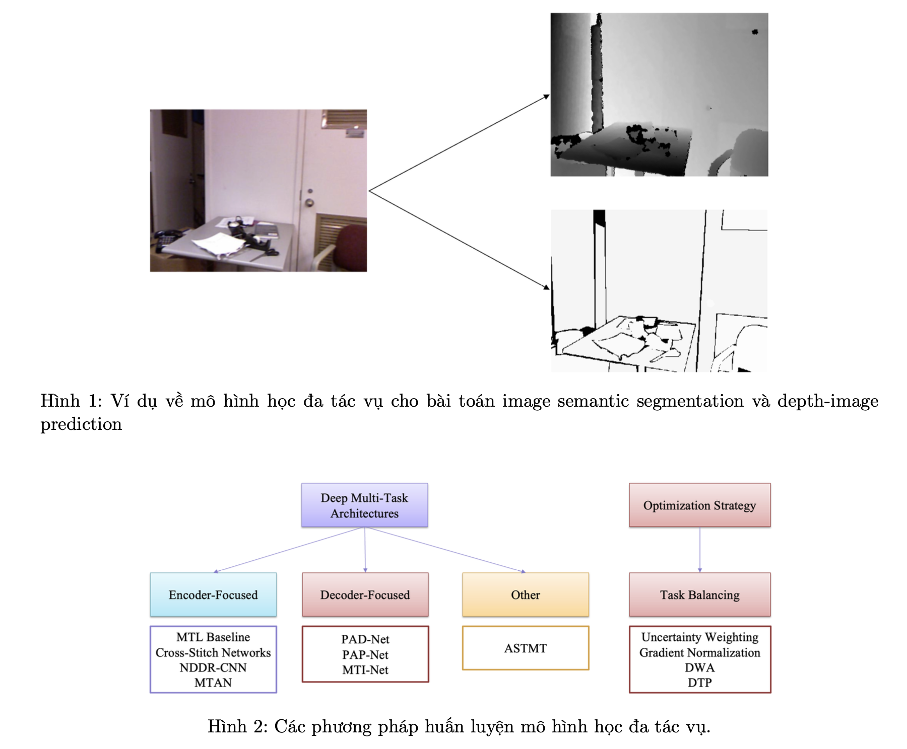
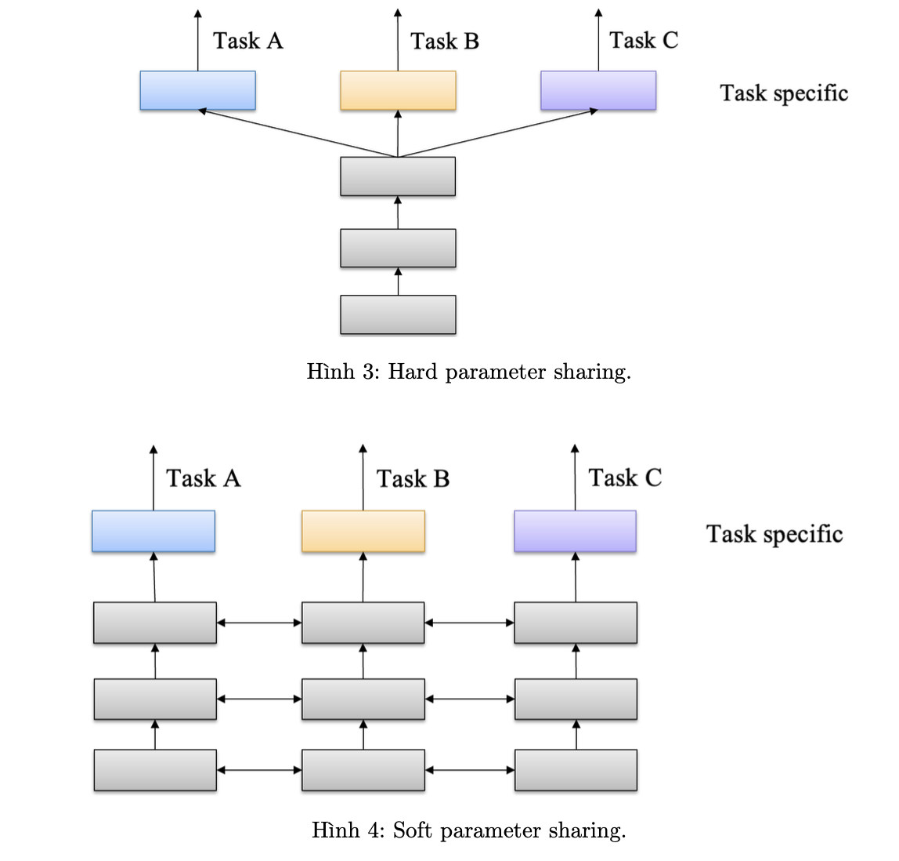

## Multi-Task Learning

#### Giới thiệu về project Multi-Task Learning :

Mô hình học đa tác vụ (Multi-Task Learning) là phương pháp huấn luyện cho một mô hình nhưng có thể giải quyết cho nhiều bài toán khác nhau. Ví dụ, chúng ta huấn luyện một mô hình với đầu vào là một hình ảnh và đầu ra giải quyết cho hai bài toán khác nhau như: semantic segmentation và depth-image prediction được mô tả như Hình 1.

Các phương pháp huấn luyện các mô hình MTL có thể được chia thành 2 nhóm:

1. Deep Multi-Task Architectures. Bao gồm các phương pháp tập trung vào xây dựng các mô hình chung để giải quyết các bài toán khác nhau. Trong đó gồm 2 thành phần chính: thành phần thứ nhất bao gồm các layer chung hoặc chia sẻ trọng số để học các đặc trưng thường gọi là shared- encoder; thành phần thứ hai bao gồm các layer riêng để học các đặc trưng để tối ưu cho từng bài toán riêng thường được gọi là task-specific layer.

2. Optimization Strategy. Với mỗi bài toán sẽ có hàm loss đánh giá khác nhau. Trong phần này sẽ tập trung xây dựng các thuật toán tối ưu trong quá trình huấn luyện và cập nhật trọng số. Điển hình trong đó là các phương pháp cân bằng trọng số khi tổng hợp hàm loss, như gradient normalization, uncertainy weighting,...

Trong phần này để bước đầu hiểu rõ về các phương pháp huấn luyện mô hình MTL, chúng ta sẽ triển khai mô hình MTL cơ bản tập trung vào tinh chỉnh phần encoder là hard parameter sharing model.

Trong project này, chúng ta sẽ xây dựng một chương trình Traffic Sign Detection sử dụng mô hình Support Vector Machine (SVM). Input và output của chương trình như sau:

• Input: Một bức ảnh có chứa biển báo giao thông.

• Output: Vị trí tọa độ và tên (class) của các biển báo có trong ảnh.

#### Cài đặt chương trình
Hai phương pháp chính bao gồm: hard parameter sharing được mô tả trong hình 3 và soft parameter sharing được mô tả trong hình 4.

Hard parameter sharing bao gồm các layer dùng chung cho tất cả các task, shared layers. Sau các shared layers bao gồm các task-specific layers cho các task khác nhau.

Soft parameter sharing bao gồm các layer dùng riêng cho các task khác nhau. Tuy nhiên, thay vì ở các layer đầu tiên của các mô hình sẽ hoạt động riêng lẽ cho các task thì sẽ có các kết nốt với đến task khác. Các kết nối có thể là tuyến tính hoặc sử dụng các hàm kích hoạt để kết nối các layer khác nhau.

Trong phần này chúng ta sẽ huấn luyện hard parameter sharing model trên bộ dữ liệu NYUD-V2 cho hai bài toán semantic segmentation và depth-image prediction. Bộ dữ liệu sau khi thực hiện các bước tiền xử lý như chuyển sang tensor,... có thể được tải về [tại đây](https://drive.google.com/drive/folders/1WQVY4CRcnqvT0igX-0lwe_tXZbUEtM9T).

2. Xây dựng mô hình phân loại biển báo giao thông
    + Preprocess data
        + Sử dụng đặc trưng HOG
        
    + Mô hình : SVM

3. Xây dựng hàm phát hiện đối tượng
    + Sử dụng kĩ thuật Sliding Window
        
    + Enhance bằng `Pyramid Image`
        

4. Metrics
    + IoU
    + Accuracy Score