## Music Genre Classification

#### Giới thiệu về project Music Genre Classification :

Trong lĩnh vực Truy xuất Thông tin Âm nhạc (MIR), Phân loại Thể loại Âm nhạc đóng một vai trò quan trọng. Bộ dữ liệu GTZAN, thường được xem như "MNIST của âm thanh", bao gồm 1.000 bản nhạc được phân loại theo 10 thể loại khác nhau, từ Blues đến Rock. Mỗi bản nhạc kéo dài 30 giây và đi kèm với biểu diễn hình ảnh và dữ liệu đặc trưng đã được trích xuất.

Xử lý âm thanh là một lĩnh vực nghiên cứu phức tạp, đòi hỏi sự hiểu biết về xử lý tín hiệu thời gian, chuỗi thời gian và trích xuất đặc trưng âm thanh. Để xây dựng một hệ thống đề xuất âm nhạc hiệu quả, việc phân loại chính xác thể loại âm nhạc là bước quan trọng, và GTZAN cung cấp một nguồn dữ liệu quý giá cho mục tiêu này.

1. `Biểu đồ sóng (Waveform)`

    Âm thanh là một dạng năng lượng do sự rung động tạo ra. Khi bất kỳ vật thể nào rung động, nó tạo ra sự di chuyển của các hạt không khí. Những hạt này va chạm vào các hạt xung quanh, khiến chúng cũng rung động và va chạm vào nhiều hạt không khí khác. Sự di chuyển này, được gọi là sóng âm, tiếp tục cho đến khi nó mất hết năng lượng. Khi những sóng âm này đến tai chúng ta, chúng làm cho màng nhĩ của chúng ta cũng rung động, và não bộ giải mã điều này thành âm thanh.

    Biểu đồ sóng là biểu diễn hình dạng và cấu trúc của một tín hiệu (như âm thanh) qua biến đổi biên độ theo thời gian. Trong ngữ cảnh của âm thanh, biểu đồ sóng mô tả đồ họa sự biến đổi áp lực (hoặc biên độ) của sóng âm so với thời gian.

    Biểu đồ sóng là biểu diễn hình ảnh của một tín hiệu âm thanh. Nó hiển thị cách biên độ của tín hiệu âm thanh thay đổi theo thời gian. Trục dọc biểu diễn biên độ, có thể được coi là độ lớn hoặc cường độ của âm thanh. Trục ngang biểu diễn thời gian. Những đỉnh trên biểu đồ sóng biểu diễn những khoảnh khắc có biên độ cao (âm thanh lớn), trong khi những đáy biểu diễn những khoảnh khắc có biên độ thấp (âm thanh nhẹ).

    Cơ bản, biểu đồ sóng cung cấp cho chúng ta một cái nhìn trực quan về động lực của âm thanh. Nó cho phép chúng ta thấy độ lớn và độ nhẹ của tín hiệu âm thanh trong suốt thời gian diễn ra, giúp ta hiểu rõ hơn về đặc điểm và cấu trúc của nó

    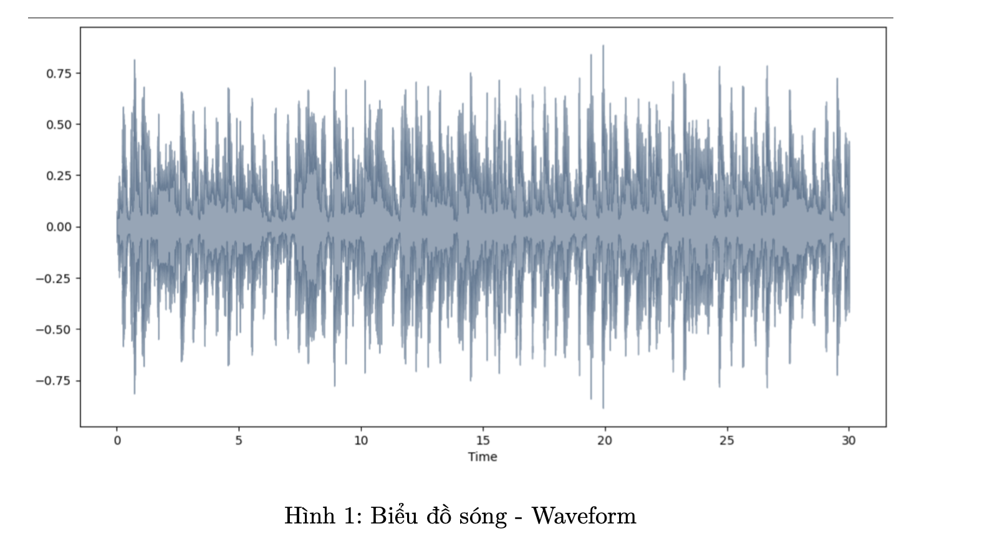

2. `Tốc độ lấy mẫu (Sampling Rate)`

    Khi chúng ta mở một tệp .wav bằng librosa, tốc độ lấy mẫu mặc định là 22.050Hz. Vậy giá trị này có ý nghĩa gì?

    Âm thanh, trong dạng tự nhiên, là một tín hiệu liên tục. Để xử lý số hóa tín hiệu này, chúng cần được chuyển đổi thành định dạng số rời rạc thông qua quá trình ’lấy mẫu’. ’Tốc độ lấy mẫu’, được đo bằng Hertz (Hz), biểu thị số lượng mẫu được lấy mỗi giây từ tín hiệu liên tục.

    Tốc độ lấy mẫu có vai trò quan trọng trong xử lý tín hiệu. Nó đảm bảo tín hiệu số được biểu diễn chính xác từ tín hiệu analog. Theo Định lý Lấy mẫu Nyquist-Shannon, để tránh mất thông tin, tín hiệu cần được lấy mẫu ít nhất gấp đôi tần số cao nhất của nó.

    Tuy nhiên, việc chọn tốc độ lấy mẫu cũng có hậu quả thực tế. Tốc độ lấy mẫu cao hơn dẫn đến dữ liệu lớn và yêu cầu tính toán cao, trong khi tốc độ thấp có thể làm mất chi tiết tín hiệu.

    Trong Trích xuất Thông tin Âm nhạc (MIR), tốc độ lấy mẫu phù hợp là rất quan trọng. MIR liên quan đến việc trích xuất đặc trưng từ tín hiệu âm thanh cho các nhiệm vụ như phát hiện cao độ hoặc phân loại thể loại. Tốc độ lấy mẫu tối ưu đảm bảo trích xuất đặc trưng chính xác.

    Thông thường, việc chọn tốc độ lấy mẫu phụ thuộc vào ứng dụng. Đối với việc phát lại âm thanh tiêu chuẩn, tốc độ 44,1 kHz được sử dụng, bắt đầu toàn bộ dải nghe của con người, khoảng 20 Hz đến 20 kHz. Các ứng dụng âm thanh chuyên nghiệp có thể sử dụng tốc độ 48 kHz, 96 kHz hoặc thậm chí 192 kHz. Đối với ứng dụng dành riêng cho giọng nói, tốc độ 8 kHz hoặc 16 kHz là có thể đáp ứng đủ.

    Trong ngữ cảnh của MIR, 44,1 kHz thường được sử dụng do cân bằng giữa việc bắt đầu toàn bộ dải nghe của con người và hiệu quả tính toán. Tuy nhiên, nhiệm vụ hoặc nguồn lực tính toán cụ thể có thể yêu cầu tốc độ khác nhau.

    Tóm lại, tốc độ lấy mẫu là một tham số quan trọng trong xử lý tín hiệu số, đảm bảo cả việc biểu diễn chính xác của tín hiệu analog và khả năng tính toán.

    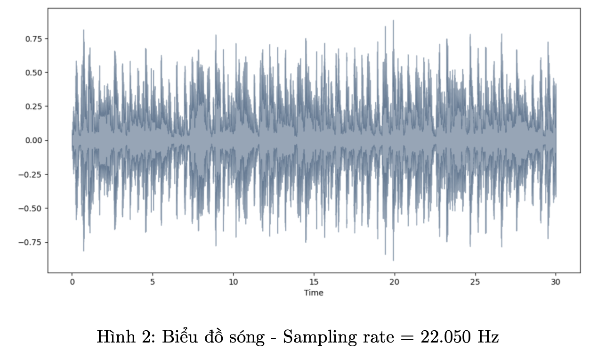

    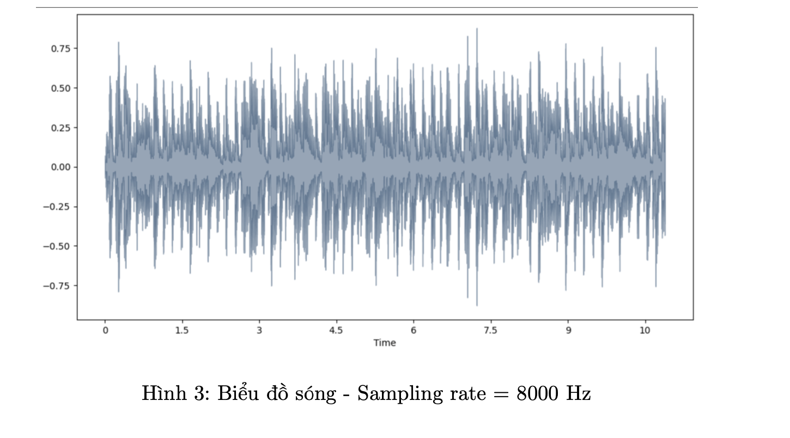

    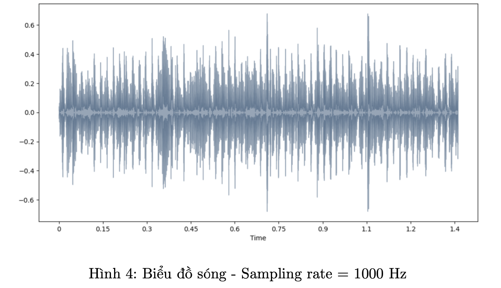

    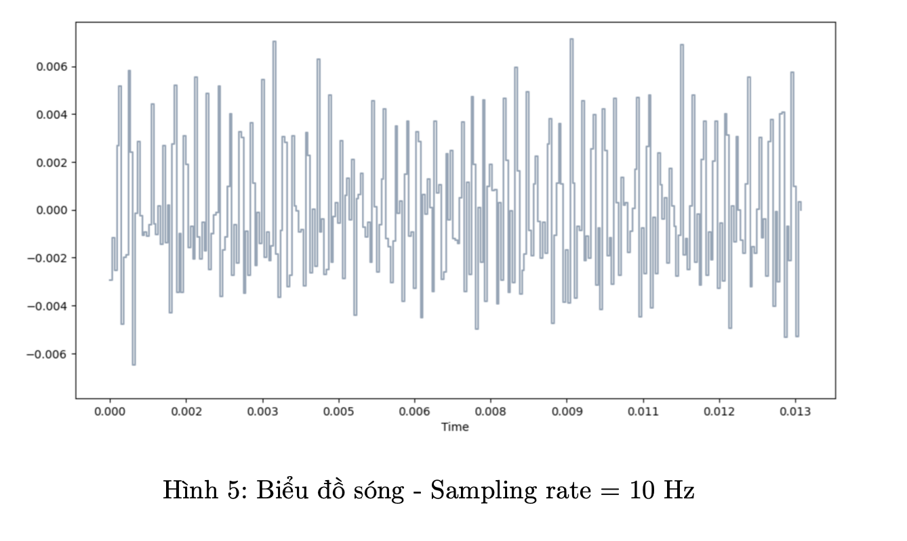

3. `Biểu đồ phổ (Spectrogram)`

    Khác với biểu đồ sóng, biểu đồ phổ phân tách một tín hiệu âm thanh thành các tần số thành phần riêng lẻ. Sau đó, nó vẽ biểu đồ biên độ của từng thành phần tần số theo thời gian. So với phân tích biểu đồ sóng, biểu đồ phổ thích hợp hơn để nắm bắt các đặc điểm liên quan đến tần số, cao độ và âm sắc của âm nhạc. Nó cung cấp cái nhìn chi tiết về cách các tần số khác nhau phân phối theo thời gian, giúp rất nhiều trong các nhiệm vụ như nhận dạng giọng nói, phân tích âm nhạc và hiểu biết về các bức tranh âm thanh phức tạp. Tuy nhiên, mặc dù nó xuất sắc trong việc biểu diễn trong miền tần số, nó có thể không cung cấp nhiều thông tin về động lực thời gian và nhịp điệu của âm nhạc.

    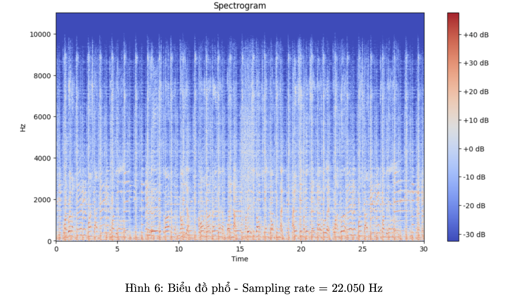

4. `Phổ Mel (Mel-Spectrogram)`

    Mặc dù biểu đồ phổ cung cấp cái nhìn chi tiết về nội dung tần số của tín hiệu theo thời gian, chúng có thể không luôn phù hợp với cách thị giác âm thanh của con người hoạt động. Tai của chúng ta không nhận biết tất cả các tần số một cách bình đẳng; chúng ta nhạy hơn đối với một số khoảng tần số, đặc biệt là các khoảng tần số tương ứng với giọng nói và nhiều công cụ nhạc cụ. Sự tỷ lệ tần số tuyến tính của biểu đồ phổ có thể không phải lúc nào cũng hiệu quả hoặc cung cấp thông tin đầy đủ khi phân tích âm thanh dưới góc độ cách con người cảm nhận chúng.

    Để giải quyết được giới hạn này, chúng ta có Phổ Mel. Phổ Mel dựa trên thang Mel, một thang nhạc lý được người nghe đánh giá có khoảng cách bằng nhau giữa chúng. Thang này gần hơn với phản ứng của tai người đối với các tần số khác nhau, làm cho nó đặc biệt quý báu trong các nhiệm vụ như phân tích giọng nói và âm nhạc.

    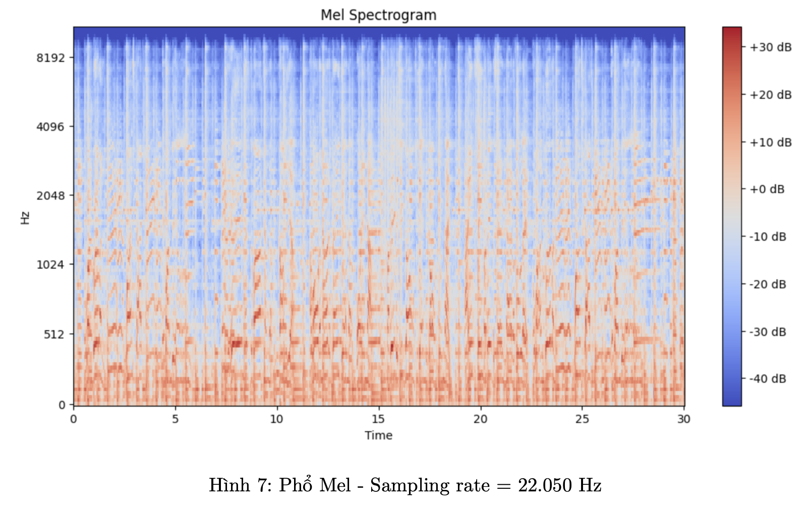

    Phổ Mel là biểu diễn của phổ công suất ngắn hạn của âm thanh, tương tự như biểu đồ phổ, nhưng với trục tần số bị bóp méo thành thang Mel. Việc bóp méo trục tần số này làm cho phổ Mel trở nên đại diện hơn về cảm nhận thị giác âm thanh của con người.

    Một cách thực tế, phổ Mel nhấn mạnh các dải tần số quan trọng nhất cho việc nghe và hiểu của con người. Ví dụ, nó cung cấp độ phân giải cao hơn cho các dải tần số mà tai người cảm nhận nhiều nhất (như tần số tương ứng với giọng nói) và độ phân giải thấp hơn ở nơi tai người cảm nhận ít hơn (như tần số rất cao).

5. `Năng lượng hiệu dụng (RMS-E)`

    Trong ngữ cảnh xử lý âm thanh và tín hiệu, RMS-E thường được sử dụng để đo "âm lượng cảm nhận" của tín hiệu âm thanh.

    RMS-E là một số liệu quan trọng trong âm thanh bởi vì cách chúng ta cảm nhận độ ồn liên quan mật thiết đến mức độ RMS của âm thanh hơn là mức đỉnh của nó. Hai âm thanh có cùng mức đỉnh có thể có độ ồn cảm nhận khác nhau nếu một trong số chúng có mức RMS-E cao hơn. Đây là lý do tại sao RMS thường được sử dụng trong các thuật toán chuẩn hóa và nén âm thanh để đảm bảo độ ồn cảm nhận được đồng nhất trên các tập âm thanh.

    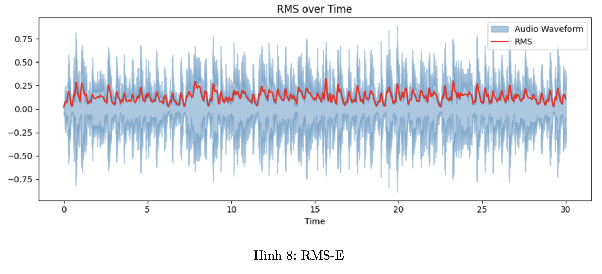

6. `Tần số cắt không (Zero-Crossing Rate)`

    Tần số cắt không (Zero Crossing Rate - ZCR) là một đặc trưng cơ bản trong xử lý và phân tích tín hiệu âm thanh. Nó biểu thị tốc độ mà tín hiệu thay đổi dấu, tức là đi từ dương sang âm hoặc ngược lại.

    Tần số cắt không cao thường cho thấy sự hiện diện của các tần số cao hơn trong tín hiệu, trong khi tần số cắt không thấp gợi ý các tần số thấp hơn. Điều này hợp lý vì các thành phần tần số cao hơn sẽ làm cho tín hiệu dao động (băng qua zero) thường xuyên hơn.

    Tiếng ồn, đặc biệt là tiếng ồn có tần số cao, có thể dẫn đến sự gia tăng của các sự băng qua zero. Do đó, một tần số cắt không cao không mong đợi đôi khi có thể là một chỉ báo của tiếng ồn.

    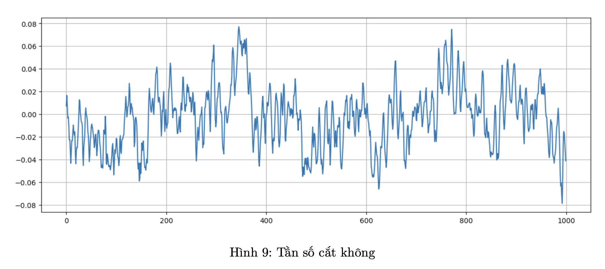

    Trong xử lý giọng nói, tần số cắt không có thể giúp phân biệt giữa các đoạn có âm hữu thanh và âm vô thanh. Các đoạn hữu thanh, như nguyên âm, thường có tần số cắt không thấp hơn, trong khi các đoạn vô thanh, như các phụ âm như "s" hoặc "f", thường có tần số cắt không cao hơn. Đặc trưng này đã được sử dụng rộng rãi trong cả việc nhận dạng giọng nói và trích xuất thông tin âm nhạc. Thông thường, nó có giá trị cao hơn cho các âm thanh có tính xúc tác cao như trong nhạc và rock.

7. `Spectral roll-off`

    Spectral roll-off là một mô tả ngắn gọn về hình dạng phổ của tín hiệu âm thanh, cung cấp thông tin về phân phối tần số và nội dung harmonics, là một đặc trưng được sử dụng trong xử lý và phân tích tín hiệu âm thanh. Spectral roll-off đại diện cho một ngưỡng mà dưới đó chứa một phần trăm cụ thể (thường là từ 85% đến 95%) của tổng năng lượng phổ.

    Nói cách khác, nếu bạn tổng hợp biên độ của các thành phần phổ từ tần số thấp nhất lên đến tần số roll-off, nó sẽ chiếm, ví dụ, 85% tổng năng lượng phổ của tín hiệu.

    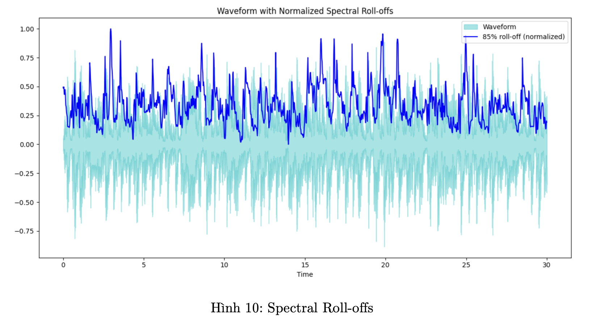

    Spectral roll-off cung cấp thông tin về hình dạng của phổ. Một tần số roll-off thấp có thể chỉ ra một tín hiệu tập trung hơn vào tần số thấp hơn, trong khi tần số roll-off cao có thể gợi ý một phổ rộng hoặc phẳng hơn.

    Trong tín hiệu âm nhạc, tần số roll-off thấp có thể chỉ ra sự ưu thế của các harmonics thấp hơn, trong khi tần số roll-off cao có thể gợi ý sự hiện diện của các harmonics cao hơn hoặc tiếng ồn.
    Spectral roll-off có thể giúp phân biệt giữa các nhạc cụ giàu harmonics và những nguyên âm cao hoặc âm thanh có nhiều bước sóng bất thường.

8. `Spectral Centroid`

    Spectral centroid là một đặc trưng được sử dụng trong xử lý tín hiệu kỹ thuật số cho thấy mức độ "sáng" hay "sắc nét" của âm thanh. Nó chỉ ra nơi "trọng tâm" phổ của tín hiệu âm thanh nằm ở đâu.

    Spectral centroid đại diện cho điểm cân đối của phổ của âm thanh. Nếu hầu hết năng lượng của âm thanh tập trung vào các tần số thấp, Spectral centroid sẽ thấp, chỉ ra một âm thanh "tối" hoặc "đục". Ngược lại, nếu năng lượng tập trung vào các tần số cao, Spectral centroid sẽ cao, chỉ ra một âm thanh "sáng" hoặc "sắc nét".
    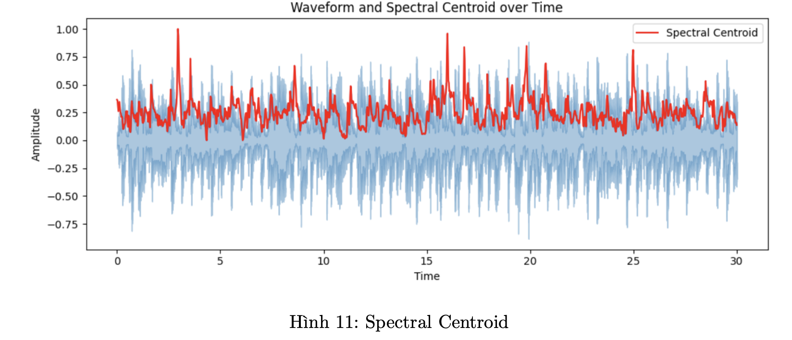

9. `Spectral Bandwidth`

    Spectral bandwidth là một đặc trưng được sử dụng trong lĩnh vực xử lý tín hiệu tín hiệu và phân tích âm thanh, nó mô tả độ rộng phổ của một tín hiệu âm thanh. Nói một cách đơn giản, nó đo lường mức độ rộng của phân phối tần số trong âm thanh.

    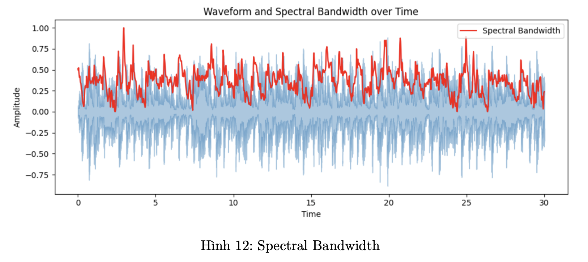

    Nếu một âm thanh có Spectral bandwidth nhỏ, điều đó có nghĩa là hầu hết năng lượng của nó tập trung vào một khoảng tần số cụ thể. Ví dụ, sóng hình sin thuần có băng thông rất hẹp vì năng lượng của nó tập trung vào một tần số duy nhất.

    Một âm thanh có Spectral bandwidth lớn có năng lượng được phân bố rộng hơn trên một loạt tần số. Nhiễu trắng, ví dụ, có Spectral bandwidth rất rộng vì nó chứa tất cả các tần số với năng lượng bằng nhau.

    Thông thường Spectral bandwidth thường đi kèm với Spectral centroid. Spectral centroid đại diện cho "trọng tâm" của phổ. Spectral bandwidth sau đó đo lường sự lan trải của phổ xung quanh trọng tâm này.

10. `Chroma`

    Đặc trưng Chroma là một công cụ mạnh mẽ trong xử lý tín hiệu âm thanh, đặc biệt trong bối cảnh âm nhạc. Chúng liên quan đến mười hai lớp tần số khác nhau và thường được sử dụng để mô tả âm hòa và hợp âm trong âm nhạc.

    Nhạc lý phương Tây được chia thành mười hai lớp tần số, tương ứng với mười hai nốt trong một quãng (ví dụ, C, C#, D, D#, ..., B). Đặc trưng Chroma bắt lượng năng lượng trong mỗi một trong những lớp tần số này, không phân biệt quãng cụ thể. Điều này làm cho đặc trưng Chroma ít nhạy cảm đối với nốt cụ thể và tập trung hơn vào nội dung hòa âm.

    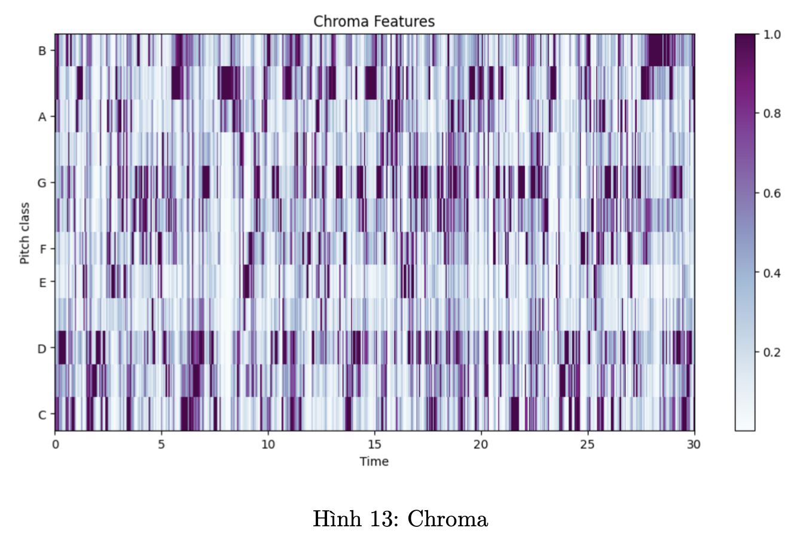

    Bởi vì đặc trưng Chroma nắm bắt được nội dung hòa âm của âm nhạc, chúng thường được sử dụng trong các thuật toán để tự động nhận diện hợp âm, tìm các phân đoạn có sự tiến triển hòa âm tương tự, trích xuất bài hát hoặc xác định các bản phối.

    Đặc trưng Chroma thường được tạo ra từ Biến đổi Fourier ngắn thời gian (STFT) của tín hiệu. Cường độ của STFT được ánh xạ vào mười hai lớp tần số, thường sử dụng một kỹ thuật gọi là "bin folding." Quá trình này bao gồm việc lấy toàn bộ năng lượng từ một nốt cụ thể trong tất cả các quãng và tổng hợp chúng vào một trong mười hai bin Chroma.

    Tóm lại, đặc trưng Chroma cung cấp một biểu diễn ngắn gọn về nội dung hòa âm trong âm nhạc, trừu tượng hóa khỏi các khía cạnh như timbre và nhịp, và tập trung vào phân phối năng lượng của các lớp tần số. Chúng là một phần quan trọng trong nhiều nhiệm vụ truy xuất thông tin âm nhạc nhờ khả năng bắt lấy bản chất hòa âm trong âm nhạc.

11. `Harmonic/Percussive Source Separation (HPSS)`

    • Thành phần Hài hòa (Harmonic Components):

        Đây là các thành phần của tín hiệu thay đổi chậm theo thời gian. Chúng tương ứng với giai điệu và hòa âm trong âm nhạc. Thành phần hài hòa thường được tạo ra bởi các nhạc cụ sản xuất âm thanh kéo dài, chẳng hạn như dây (như violin hoặc guitar), tiết tấu (như sáo), và nhạc cụ đồng.

        Trong miền tần số, thành phần hài hòa xuất hiện dưới dạng các đỉnh rõ ràng, chúng chủ yếu là tần số cơ bản của nốt nhạc đang được chơi và các âm phụ của nó (bội số nguyên của tần số cơ bản).
    • Thành phần Gõ (Percussive Components):

        Thành phần gõ của một tín hiệu thường là tạm thời và thay đổi nhanh chóng theo thời gian. Chúng tương ứng với nhịp điệu trong âm nhạc. Chúng được tạo ra bởi các nhạc cụ gõ như trống, tambourine, và conga. Nhưng không phải tất cả âm thanh gõ đều đến từ các nhạc cụ gõ truyền thống; việc gảy dây của một cây guitar hoặc sự tấn công của một nút piano cũng có thể có yếu tố gõ mạnh.
        
        Trong miền tần số, thành phần gõ phân bố qua một loạt các tần số mà không có đỉnh rõ ràng. Chúng xuất hiện như những cơn nổ đột ngột trong biểu diễn miền thời gian.
    • Tách nguồn Hài hòa/Gõ (HPSS):

        Đây là một khái niệm quan trọng trong MIR. Đó là một kỹ thuật được sử dụng để tách các
        thành phần hài hòa và gõ của tín hiệu âm nhạc. Động lực cho sự tách biệt này bao gồm các ứng dụng như:

            – Điều chỉnh các yếu tố nhịp điệu so với yếu tố giai điệu một cách độc lập.
            – Đơn giản hóa công việc phiên âm các nhạc cụ nhịp điệu riêng biệt từ các nhạc cụ giai
            điệu.
            – Cho phép nghiên cứu nhịp điệu và giai điệu một cách riêng biệt.

            HPSS thường được thực hiện bằng các phương pháp lọc trung bình trong miền thời gian-tần số. Một phương pháp, chẳng hạn, bao gồm việc lấy biểu đồ phổ của một tín hiệu và áp dụng các bộ lọc trung bình dọc theo thời gian (để bảo tồn hài hòa) và tần số (để bảo tồn gõ). Điều này cho phép tách biệt các thành phần hài hòa và gõ dựa trên đặc tính tự nhiên của chúng trong biểu diễn thời gian-tần số.

    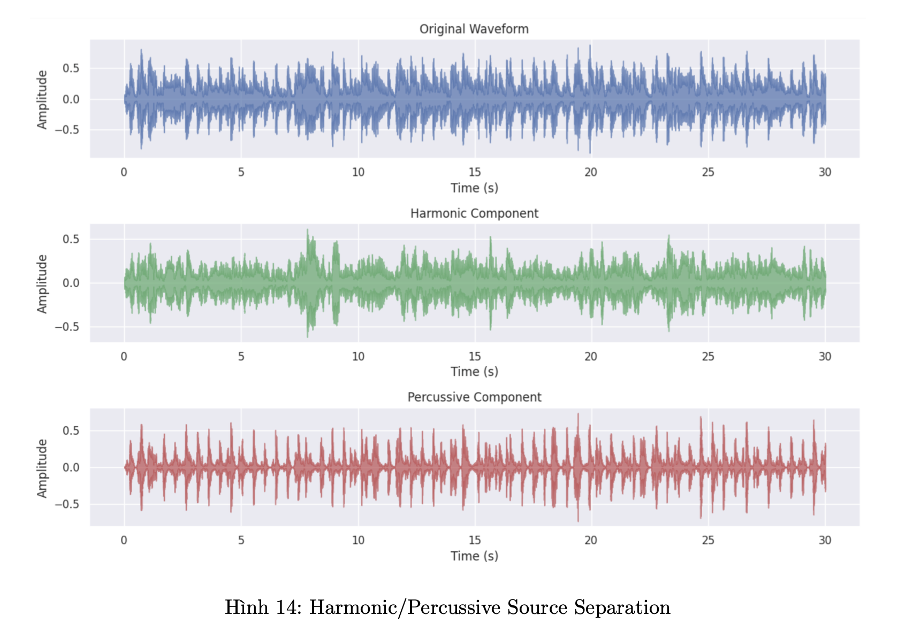

12. `Hệ số Cepstral Tần số Mel (MFCC)`

    MFCC là một tập các đặc trưng thường được sử dụng trong xử lý tín hiệu âm thanh, đặc biệt trong ngữ cảnh của nhận dạng giọng nói và tiếng nói. Chúng cung cấp một biểu diễn gọn gàng của phổ công suất ngắn hạn của âm thanh và dựa trên nhận thức về thính giác của con người.

    MFCC là một trong những đặc trưng phổ biến nhất được sử dụng trong sinh trắc học giọng nói để xác thực người dùng dựa trên đặc điểm giọng nói độc đáo của họ. Chúng có thể nắm bắt được nội dung ngữ âm của tín hiệu giọng nói.

    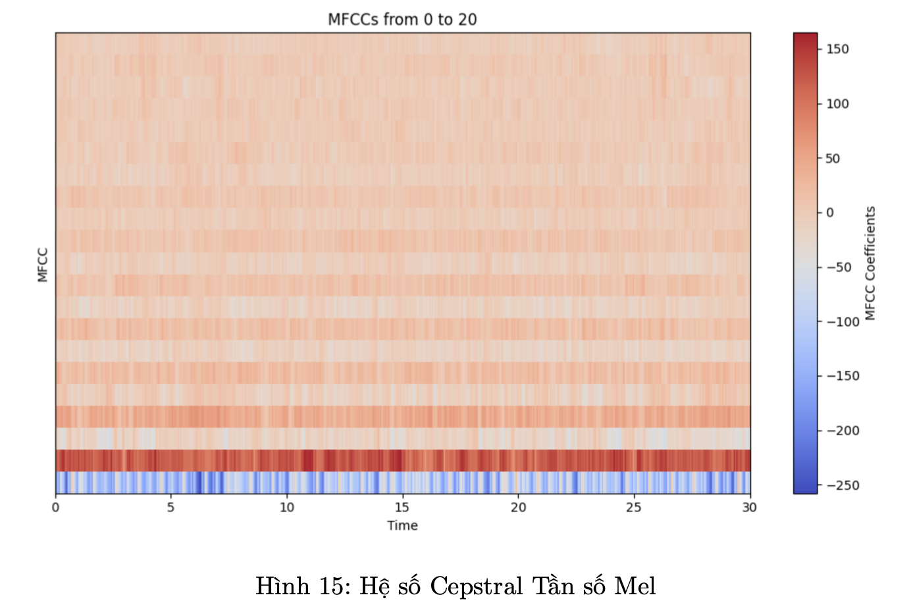

    Mặc dù phổ biến hơn trong xử lý giọng nói, MFCC cũng được sử dụng trong một số nhiệm vụ trích xuất thông tin âm nhạc, như phân loại thể loại hoặc nhận dạng nhạc cụ.

    Tóm lại, MFCC cung cấp một biểu diễn của hình dạng phổ ngắn hạn của âm thanh. Chúng được thiết kế để mô phỏng hệ thống thính giác của con người, làm cho chúng đặc biệt hiệu quả cho các nhiệm vụ liên quan đến giọng nói và tiếng nói của con người.
#### Cài đặt chương trình
1. Dataset : [GTZAN Dataset](https://drive.google.com/file/d/1MGhyeMngD6P9Kz9zJpL68ylQaIQvW7Zx/view)

2.  Trích xuất đặc trưng
    + Thực hiện tính các đặc trưng dựa trên các tệp âm thanh cho trước rồi lưu thành file csv. (tổng cộng 60 column)
    

3.  Machine Learning Solution
    + KNN Classifier
    + SVM Classifier

4.  Neural Network Solution
    + MLP Network
    + Cross Entropy Loss
    + Optim Adam
5. Evaluation
    + Metrics : Precision, Recall, F1-Score
