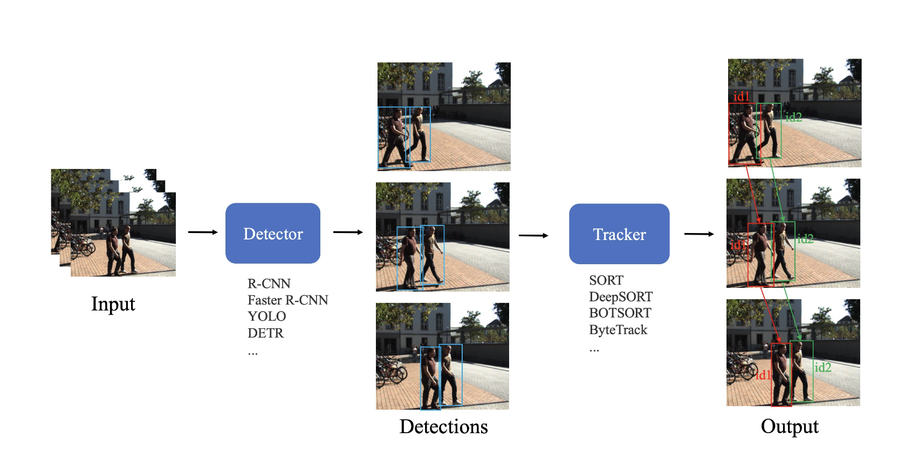
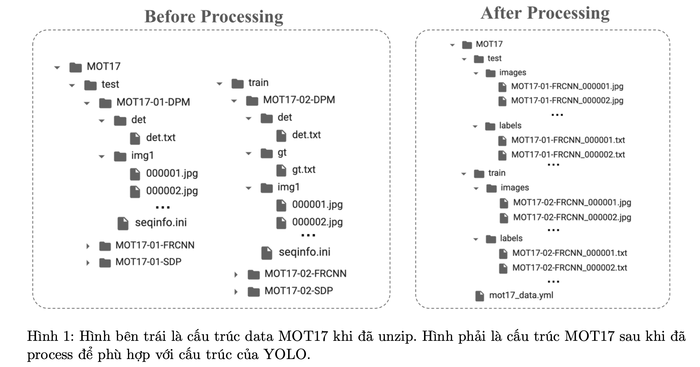

## Object Tracking

#### Giới thiệu về project Object Tracking :

`Object Tracking` là một bài toán quan trọng trong lĩnh vực Computer Vision, đòi hỏi khả năng liên tục theo dõi và xác định vị trí của các object trong các khung hình video liên tục. Một trong những phương pháp phổ biến để giải quyết bài toán này là sử dụng kết hợp giữa model YOLOv8 và thuật toán DeepSORT.

YOLO (You Only Look Once) là một model object detection nhanh chóng và hiệu quả, cho phép xác định các object trong một hình ảnh hoặc video bằng cách chia hình ảnh thành grid, việc predict bounding box và class class label diễn ra trên từng grid cell.

DeepSORT (Simple Online and Realtime Tracking with a Deep Association Metric) là một thuật toán object tracking dựa trên sự kết hợp giữa deep learning và kỹ thuật theo dõi dựa trên đặc trưng. Nó sử dụng mạng siamese để tính toán sự tương đồng giữa các bounding box liên tiếp trong các khung hình và tracking các object dựa trên sự thay đổi trong sự tương đồng này.

Khi kết hợp YOLOv8 và DeepSORT, ta có thể thực hiện việc phát hiện và theo dõi object trong video một cách hiệu quả. YOLOv8 sẽ xác định object trong từng frame ảnh, sau đó DeepSORT sẽ sử dụng thông tin này để xác định và tracking các object theo thời gian. Kết quả là một hệ thống hoàn chỉnh cho việc tracking các object trong video, có thể được ứng dụng trong nhiều lĩnh vực như giám sát an ninh, theo dõi giao thông, và nhiều ứng dụng khác đòi hỏi sự hiểu biết và quản lý vị trí của các object trong thời gian thực.

Trong project này, ta sẽ xây dựng một chương trình Pedestrian Tracking (vật thể tracking ở đây là người đi bộ) sử dụng YOLOv8 và DeepSORT. Input và output của chương trình như sau:

• Input: Một video có chứa người đi bộ.

• Output: Đường di chuyển (trajectory) của những người đi bộ trong video.

#### Cài đặt chương trình
1. Dataset : [MOT17 Dataset](https://motchallenge.net/data/MOT17.zip)

    
    + Xử lý đưa về đúng format của YOLO

2. Xây dựng mô hình YOLOv8 Detector
    + Loss function : DETR Loss bao gồm  classification loss, bounding box loss, GIoU loss, và auxiliary losses.

3. Xây dựng mô hình DeepSORT Tracker
    + Reference : [DeepSORT](https://viblo.asia/p/sort-deep-sort-mot-goc-nhin-ve-object-tracking-phan-2-djeZ1m78ZWz)

4. Evaluation
    + Metrics for Object Tracking
