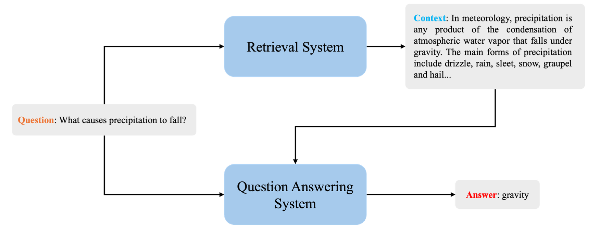
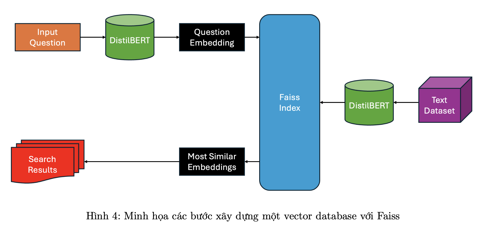

## Question Answering

#### Giới thiệu về project Question Answering :

Trong project này, chúng ta sẽ tập trung vào việc phát triển một hệ thống end-to-end hỏi đáp tự động, với khả năng trả lời một câu hỏi với nội dung bất kì. Hệ thống mà chúng ta cài đặt trong project này bao gồm hai phần chính là Retriever và Reader, với mục tiêu xây dựng một hệ thống toàn diện có khả năng rút trích thông tin từ văn bản và cung cấp câu trả lời cho các câu hỏi dựa trên nội dung của đoạn văn.

Cụ thể, ta sẽ xây dựng chương trình dựa vào dataset SQuAD2.0, một bộ dữ liệu về đọc hiểu, vector database là FAISS và mô hình BERT để thực hiện các nhiệm vụ cụ thể trong chương trình. Input và output của chương trình như sau:

• Input: Một câu hỏi.

• Output: Câu trả lời tương ứng.

#### Cài đặt chương trình
1. Dataset : SQuAD2.0 Dataset từ `HuggingFace`

2. Xây dựng mô hình `Reader` (model QA)
    + Model : `DistilBERT`
    + Nhiệm vụ `Reader` là từ question và context sẽ thực hiện extract thông tin để đưa ra answer

3. Xây dựng mô hình `Retriever`
    + FAISS
    + Nhiệm vụ tìm kiếm các context phù hợp nhất cho câu hỏi đầu vào để đưa vào `Reader`
    + Các bước
        + Với bộ dữ liệu SQuAD2.0, ta sẽ xây dựng một database chứa thêm cột đại diện cho vector embedding của câu hỏi.

        + Thực hiện embedding các câu hỏi sử dụng DistilBERT.

        + Thực hiện tìm kiếm tương đồng giữa các vector trong cột mới và vector câu hỏi đầu vào, từ đó tìm ra nội dung context có liên quan nhất.

    

