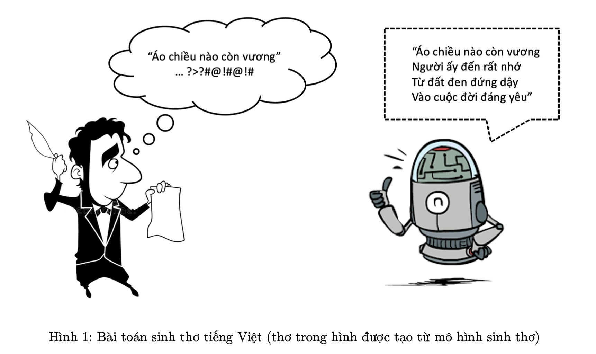

## POEM GENERATION

#### Giới thiệu về project Poem Generation:

Text Generation là một trong các dạng bài toán thuộc lĩnh vực xử lý ngôn ngữ tự nhiên hiện đang rất được cộng đồng quan tâm, với khả năng tạo ra các câu từ mới dựa trên dữ liệu đầu vào. Chính bởi các kết quả trả về mang tính "sáng tạo", đáp ứng được các nhu cầu bài toán khác nhau từ mô hình này mà nó đã và đang được ứng dụng vào các sản phẩm nổi tiếng hiện nay, điển hình nhất chính là ChatGPT, một ứng dụng Chatbot đã tạo nên cơn sốt trên toàn thế giới thời gian qua.

Trong project này, chúng ta sẽ cùng triển khai một chương trình sử dụng mô hình Text Generation với chủ đề sinh thơ Tiếng Việt dựa vào một từ tiếng Việt đầu vào từ người dùng.
 Như vậy, Input/Output của chương trình là:

• Input: Một chuỗi gồm các kí tự mở đầu cho bài thơ. 

• Output: Bài thơ hoàn chỉnh.
#### Cài đặt chương trình
1. Data Crawling : Thực hiện đi thu thập dữ liệu trên các trang web văn thơ Việt Nam `thivien.net`

    Dữ liệu sau khi đã thu thập thông qua `Selenium` : [Poem Dataset](https://drive.google.com/file/d/1KfrBAycsgQBt1mtEbzJh5pSYL8YIk0Tc/view?usp=sharing)

2. Xây dựng mô hình sinh thơ
    + Fine-tuning trên GPT2
    + From Scratch

