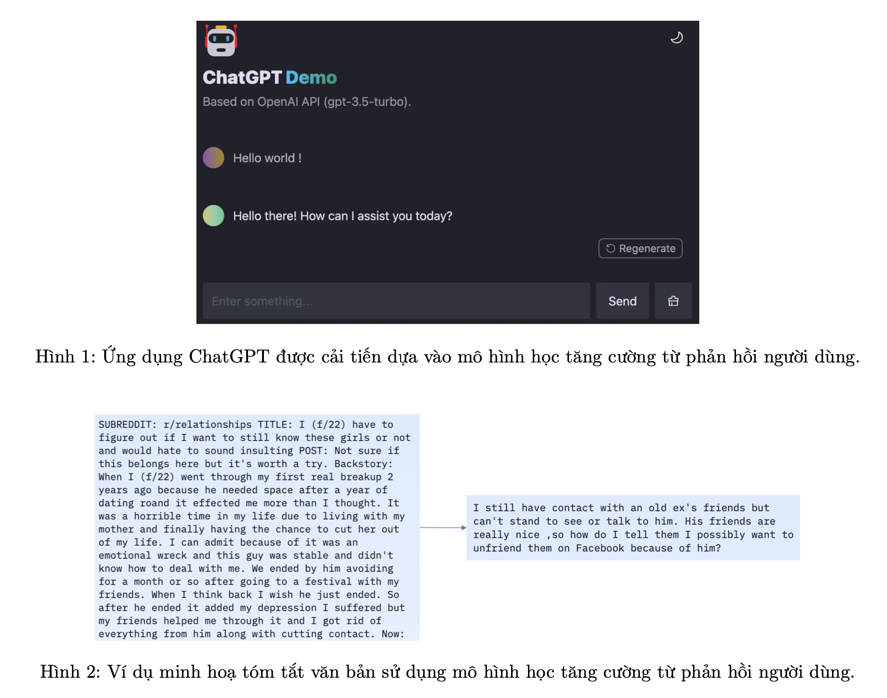
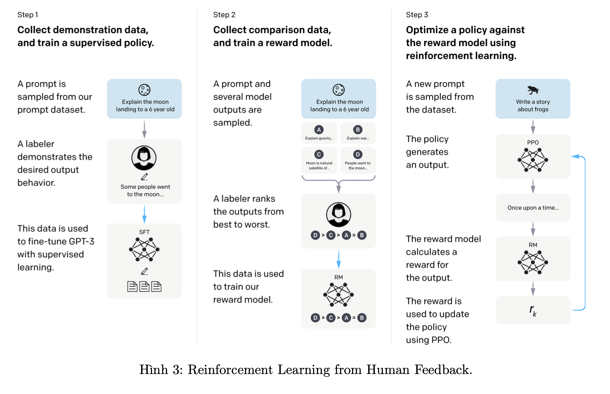
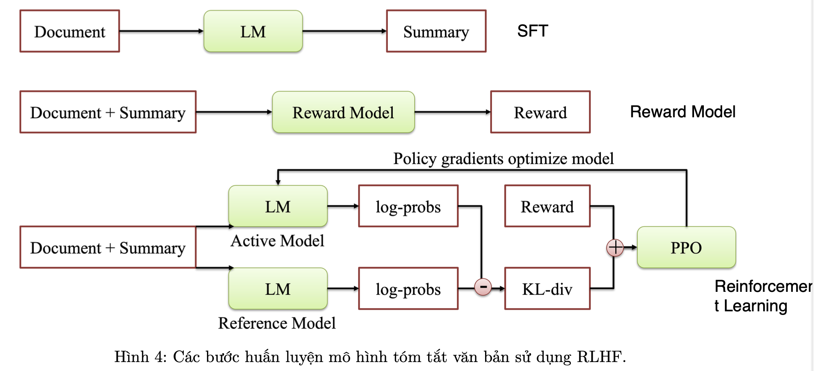
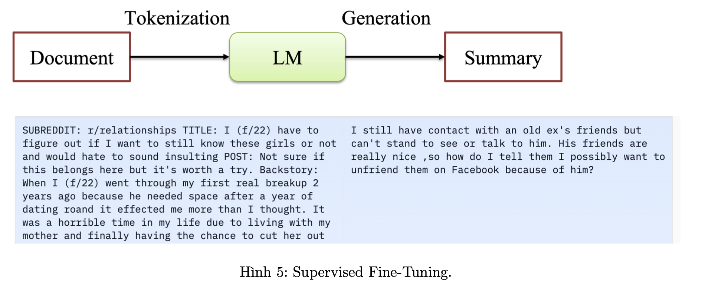
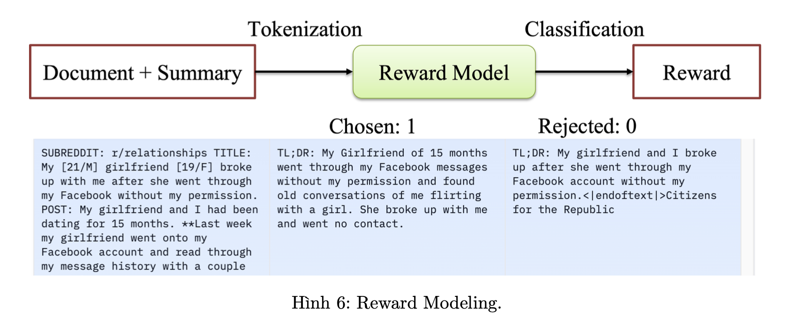
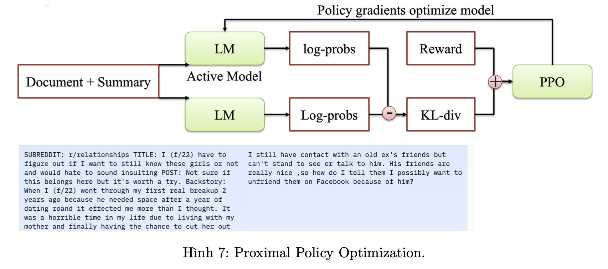

## Reinforcement Learning From Human Feedback

### Giới thiệu về project RLHF :

ChatGPT (Chat Generative Pre-Training Transformer) là mô hình chatbot được phát triển bởi OpenAI ra mắt vào tháng 11 năm 2022. ChatGPT được xây dựng dựa trên việc tinh chỉnh mô hình ngôn ngữ lớn (Large Language Model) kết hợp với học tăng cường dựa trên phản hồi của con người (Reinforcement Learning with Human Feedback).

ChatGPT có thể giải quyết nhiều bài toán khác nhau trong xử lý tự nhiên như: phân loại văn bản (Text Classification), bài toán dịch máy (Machine Translation), bài toán hỏi đáp (Question Answering), bài toán tóm tắt văn bản (Text Summarization),... Từ các bài toán gốc cơ bản này, ChatGPT được triển khai cho nhiều lĩnh vực khác nhau: giáo dục, sáng tạo nội dung, chăm sóc sức khoẻ,...

Mô hình ChatGPT còn có khả năng tương thích, tối ưu cho bài toán cụ thể trong quá trình dự đoán (Inference - đưa ra phản hồi cho các bài toán) thông qua phương pháp học tập trong ngữ cảnh (In-Content Learning). Phương pháp học tập trong ngữ cảnh được xây dựng thông qua các prompt, được hiểu là các dữ liệu đầu vào với mục tiêu hướng dẫn hoặc mô tả chi tiết cho bài toán giúp ChatGPT có thể xác định được bài toán cần xử lý và tối ưu miền xử lý, nhờ đó ChatGPT có thể cho kết quả tốt hơn.

(a) Zero-shot: Đưa ra câu trả lời chỉ dựa vào mô tả của bài toán

(b) One-shot: Đưa ra câu trả lời dựa vào mô tả bài toán và một ví dụ mẫu cho bài toán

(c) One-shot: Đưa ra câu trả lời dựa vào mô tả bài toán và một vài ví dụ mẫu cho bài toán

Một trong những kỹ thuật giúp cho mô hình ngôn ngữ đạt kết quả tốt là cải tiến các mô hình này dựa vào học tăng cường từ phản hồi của người dùng (RLHF - Reinforcement learning from human feedback). Trong phần này chúng ta sẽ tập trung vào đi sâu tìm hiểu về RLHF.

(a) Supervised fine-tuning (SFT)
Trong phần này chúng ta sử dụng 1 tập các prompt và response để tinh chỉnh mô hình ngôn ngữ. Mô hình GPT2 được chọn với 12 khối Transformer-Decoder. Ngoài ra, có nhiều mô hình ngôn ngữ có thể chọn phù hợp với mục tiêu và open source như BLOOM, LLaMa,...

(b) Reward Modeling (RM)
Trong phần này chúng ta sử dụng tập dữ liệu Helpful and Harmless để huấn luyện mô hình RM. Với mỗi prompt chúng ta sẽ có 1 response là có nhãn "chosen" và 1 response có nhãn là "rejected". Mục tiêu của phần này với mỗi prompt và response chúng ta cần đưa ra điểm số tương ứng.

(c) Reinforcement learning (RL)
Trong phần này chúng ta sử dụng bộ dữ liệu rm-static, kết hợp với mô hình RM để tinh chỉnh mô hình SFT dựa vào phương pháp huấn luyện sử dụng Proximal Policy Optimization (PPO).

### Cài đặt chương trình

#### Text Summarization with RLHF

RLHF bao gồm 3 phần:

• Supervised Fine-Tuning: Tinh chỉnh mô hình trên bộ dữ liệu có nhãn cho bài toán tóm tắt 

+ Trong phần này chúng ta sẽ tinh chỉnh mô hình tiền huấn luyện như GPT, BLOOM, FlanT5,... trên bộ dữ liệu được gán nhãn. Bộ dữ liệu [openai_summarize_tldr](https://huggingface.co/datasets/CarperAI/openai_summarize_tldr) bao gồm các cặp dữ liệu: văn bản và bản tóm tắt.

• Reward Modeling: Huấn luyện mô hình cho điểm chât lượng bản tóm tắt
+ Trong phần này chúng ta sẽ xây dụng mô hình đánh giá chất lượng bản tóm tắt. Đầu vào của mô hình là văn bản kết hợp với bản tóm tắt. Đầu ra là giá trị dự đoán từ 0 đến 1. Chúng ta sẽ tinh chỉnh mô hình SFT cho bài toán phân loại. Với bản tóm tắt phù hợp (Chosen) sẽ có nhãn là 1, và bản tóm tắt không phù hợp (Rejected) sẽ có nhãn là 0. [Dataset](https://huggingface.co/datasets/CarperAI/openai_summarize_comparisons)

• Reinforcement Learning: Tinh chỉnh mô hình dựa vào học tăng cường để cải tiến mô hình
+ Trong phần này chúng ta tối ưu mô hình SFT dựa vào mô hình Reward sử dụng thuật toán Proximal Policy Optimization (PPO). [openai_summarize_tldr](https://huggingface.co/datasets/CarperAI/openai_summarize_tldr)

