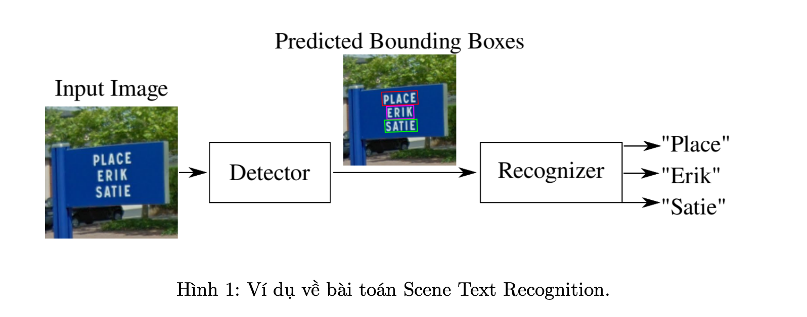
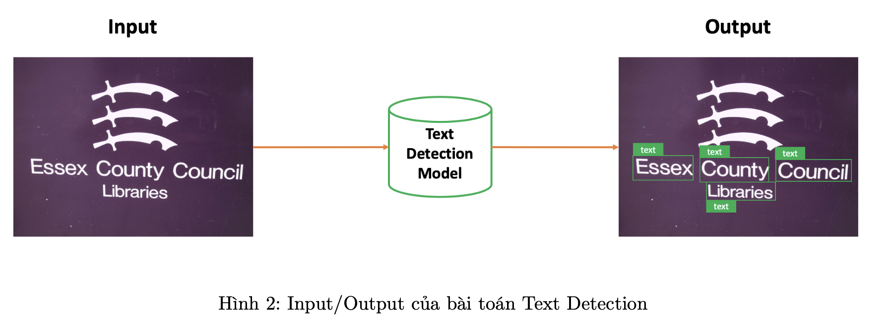
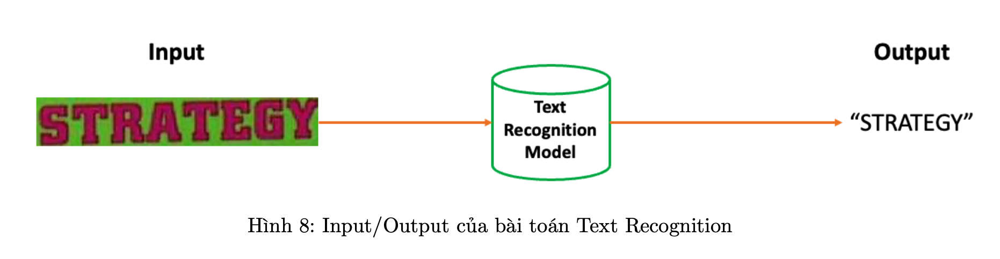
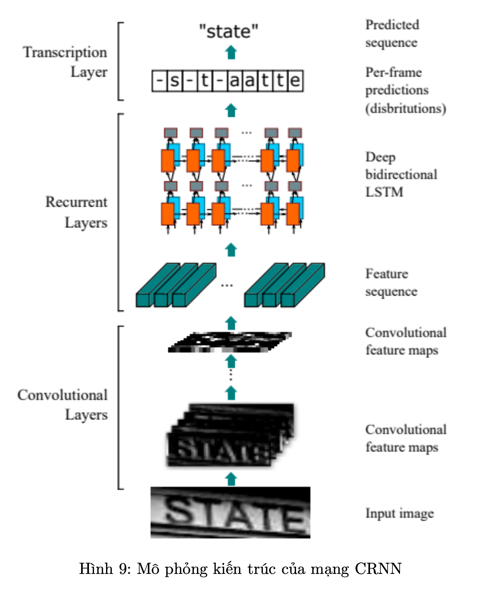

## Scene Text Recognition

#### Giới thiệu về project Scene Text Recognition :

`Scene Text Recognition` là một bài toán ứng dụng các thuật toán xử lý ảnh và nhận dạng ký tự để nhận dạng văn bản xuất hiện trong các cảnh ảnh tự nhiên. Bài toán này có nhiều ứng dụng trong thực tế, chẳng hạn như:

• Xử lý văn bản trong ảnh: Nhận dạng văn bản trong các tài liệu, sách báo, biển báo,...

• Tìm kiếm thông tin: Nhận dạng văn bản trong các hình ảnh trên mạng, để trích xuất thông tin
cần thiết.

• Tự động hóa: Nhận dạng văn bản trong các hình ảnh để tự động hóa các tác vụ, chẳng hạn như xử lý đơn hàng, thanh toán,...

Một chương trình Scene Text Recognition thường bao gồm hai giai đoạn chính là: 

• Phát hiện văn bản (Detector): Xác định vị trí của văn bản trong ảnh.

• Nhận diện văn bản (Regconizer): Nhận diện văn bản ở các vị trí đã xác định.

Ở project này, chúng ta sẽ xây dựng một chương trình Scene Text Recognition sử dụng YOLOv8 (phát hiện văn bản) và CRNN (nhận dạng từ). Input và output của chương trình như sau:

• Input: Một bức ảnh có chứa chữ.

• Output: Vị trí tọa độ và đoạn chữ trong ảnh.

#### Cài đặt chương trình
1. Dataset : [ICDAR2003 Dataset](https://drive.google.com/file/d/1x9e2FNDlKc_lBkJvHvWSKKfCSSqNsQfM/view)

2. Xây dựng mô hình Text Detection sử dụng YOLOv8
    + Thực hiện biến đổi sang YOLO format
    + Loss function : DETR Loss bao gồm  classification loss, bounding box loss, GIoU loss, và auxiliary losses.
    + `data.yaml` : Để tiện cho việc truy cập đường dẫn của các folder train, test và val, cũng như số lượng và tên các class thì ta cần tạo 1 file data.yaml để lưu trữ các thông tin này.
    

3. Xây dựng mô hình Text Recognition 
    + Sử dụng CRNN
        

        

    + Loss Function : CTC Loss

4. Evaluation
    + Metrics : Tuỳ thuộc từng model