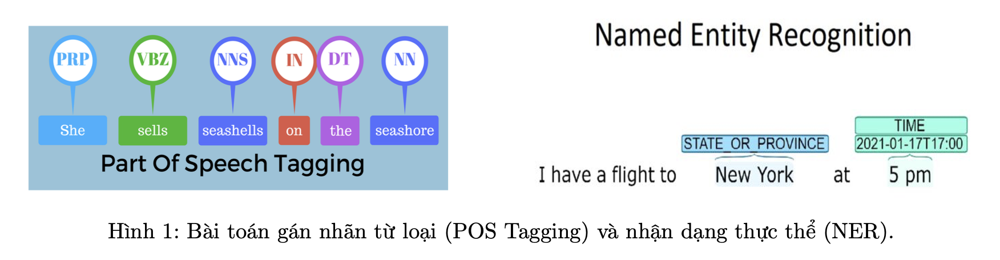

## Text Classification using Neural Network


#### Giới thiệu về project Text Classification using Neural Network :

Phân loại văn bản (Text Classification) là một trong những bài toán cơ bản trong xử lý ngôn ngữ tự nhiên. Với yêu cầu của bài toán gán nhãn cho một đơn vị văn bản (văn bản, đoạn văn bản, câu, từ,...) với nhãn được xem xét từ một tập nhãn cho trước.
Phân loại các bài toán phân loại dựa vào đơn vị văn bản cần phân loại có:

- Token-level Classification: gán nhãn cho các đơn vị văn bản là các từ (token). Các bài toán điển hình trong nhóm này là: gán nhãn từ loại (Part-of-Speech Tagging) gán mỗi từ trong câu với các loại từ: danh từ, động từ,... và nhận dạng thực thể (Named Entity Recognition) gán nhãn cho các từ thuộc một thực thể nhất định như người, địa điểm,...



- Document-level Classification: gán nhãn cho các đơn vị văn bản là các cụm từ, câu, đoạn văn. Các bài toán điển hình gồm có phân loại văn bản vào kinh tế, chính trị,... Phân tích cảm xúc (Sentiment Analysis): phân loại văn bản thành nhãn tích cực, tiêu cực hoặc trung tính.


Phân loại các bài toán phân loại dựa vào số nhãn:
- Binary Classification: phân loại với số nhãn là 2. Ví dụ bài toán phân tích cảm xúc
- Multiclass Classification: phân loại với số nhãn nhiều hơn 2. Ví dụ: kinh tế, chính trị, văn hoá,... - Multilabel Classification: phân loại một đơn vị văn bản có thể thuộc vào một hoặc nhiều nhãn.

Bài toán phân loại có nhiều ứng dụng quan trọng. Ứng dụng trong phân tích cảm xúc bình luận khách hàng với các sản phâm. Phân loại các thông tin giả mạo,...

#### Cài đặt chương trình
1. Dataset : [NTC-SCV Dataset](https://github.com/congnghia0609/ntc-scv.git)

```
# Download data from github
!git clone https://github.com/congnghia0609/ntc-scv.git !unzip ./ntc-scv/data/data_test.zip -d ./data
!unzip ./ntc-scv/data/data_train.zip -d ./data
!rm -rf ./ntc-scv
```


2.  Tiền xử lý dữ liệu văn bản
    + Xoá bỏ những bình luận không phải tiếng việt
    

    + Làm sạch dữ liệu
        + Các bước tiền làm sạch liệu:
            + Xoá bỏ thẻ HTML, đường dẫn URL
            + Xoá bỏ dấu câu, số
            + Xoá bỏ các ký tự đặc biệt, emoticons,... 
            + Chuẩn hoá khoảng trắng
            + Chuyển sang viết thường
3.  Biểu diễn dữ liệu văn bản thành các vectors
    + Dùng thư viên `torchtext`
4.  Xây dựng mô hình phân loại
    + Xây dựng Neural Network
5.  Huấn luyện mô hình
    + Loss : CrossEntropy
    + Optimizer : SGD
6.  Dự đoán, đánh giá mô hình
    + Metrics : Acccuracy Score