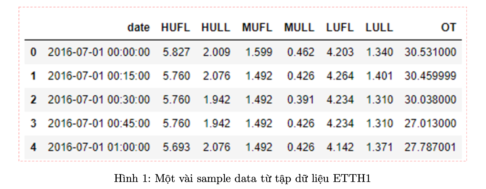

## Time-series Forecasting

#### Giới thiệu về project Time-series Forecasting :

Phân phối nguồn điện là quá trình chuyển giao và phân phối năng lượng điện từ các nhà máy điện đến người sử dụng cuối cùng. Đây là một phần quan trọng trong hệ thống điện để đảm bảo cung cấp điện ổn định và đáng tin cậy cho người dân và các doanh nghiệp. Nhưng việc dự đoán nhu cầu tiếp theo của một khu vực cụ thể là khó khăn, vì nó thay đổi theo các ngày trong tuần, ngày lễ, mùa, thời tiết, nhiệt độ, v.v. Tuy nhiên, không có phương pháp hiện tại nào có thể thực hiện dự đoán dài hạn dựa trên dữ liệu thưc tế với độ chính xác cao. Bất kỳ kết quả dự đoán sai lầm nào có thể gây hại cho máy biến áp điện. Do đó, hiện tại, không có một phương pháp hiệu quả để dự đoán việc sử dụng điện trong tương lai, do đó các nhà quản lý phải đưa ra dự đoán dựa trên kinh nghiệm, mà khi đó kết qua dự đoán thường cao hơn nhiều so với nhu cầu thực tế. Điều này gây lãng phí điện và giảm giá trị của thiết bị. Thông qua quá trình nghiên cứu, người ta nhận thấy rằng nhiệt độ dầu có thể phản ánh tình trạng của máy biến áp điện. Một trong những chiến lược hiệu quả nhất là dự đoán làm thế nào nhiệt độ dầu của máy biến áp điện là an toàn và tránh lãng phí không cần thiết. Do đó, để giải quyết vấn đề này, công ty Phát triển Khoa học và Công nghệ Guowang Fuda của Bắc Kinh đã xây dựng hệt thống thu thập dữ liệu trong 2 năm về nhiệt độ dầu của máy biến áp điện. Dựa trên bộ dữ liệu Electricity Transformer Dataset (ETDataset dataset ), chúng ta có thể phát triển các phương pháp dự đoán nhiệt độ dầu của bộ máy áp điện và khả năng chịu tải tối đa của nó.

Bộ dữ liệu `ETDataset` (ETTH1, hình 1) bao gồm 7 thông tin như sau: the recorded date, high useful load (HUFL), high useless load (HULL), middle useful load (MUFL), middle useLess load (MULL), low useful load (LUFL), low useLlss load (LULL), và oil temperature (OT).

Trong project này chúng ta sẽ sử dụng các giải thuật multilayer perceptron(MLP), recurrent neural network (RNN), long-short term memory (LSTM), Bidirectional LSTM (Bi-LSTM) và XGBoost để dữ đoán nhiệt độ dầu của máy biến áp. ETTh1 dataset được tổ chức thành 3 trường hợp khác nhau để đánh giá để đánh giá độ chính xác của các giải thuật cho bài toán dự đoán time-series data:

• Case study 1 (Multivariate to Multivariate):

    1. Input: HUFL, HULL, MUFL, MULL, LUFL, LULL và OT

    2. Output: HUFL, HULL, MUFL, MULL, LUFL, LULL và OT
    
• Case study 2 (Multivariate to Univariate):

    1. Input: HUFL, HULL, MUFL, MULL, LUFL, LULL và OT 

    2. Output: OT

• Case study 3 (Univariate to Univariate): 

    1. Input: OT

    2. Output: OT

#### Cài đặt chương trình
1. Dataset : [ETDataset](https://github.com/zhouhaoyi/ETDataset)

2. EDA 

3. Cài đặt mô hình : MLP, RNN, LSTM, và Bi-LSTM.
    + Loss functiom : L1Loss

4. Evaluation
    + Metrics : MAE