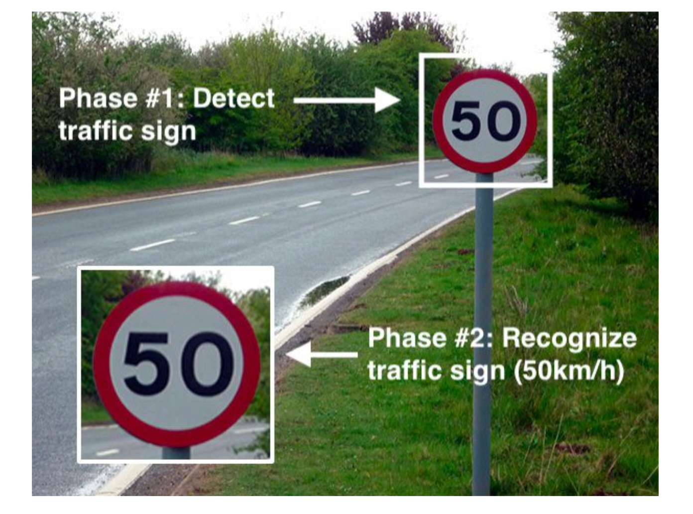

## TRAFFIC SIGN DETECTION

#### Giới thiệu về project Traffic Sign Detection :

`Traffic Sign Detection` là một bài toán ứng dụng các thuật toán liên quán đến Object Detection để phát hiện các biển báo giao thông trên đường. Các mô hình Traffic Sign Detection thường được sử dụng rất nhiều trong các bài toán lớn như Self-driving Cars, Advanced Driver Assistance Systems... Một chương trình Traffic Sign Detection thường bao gồm hai giai đoạn là xác định vị trí của biển báo và nhận diện tên biển báo. Vì vậy, một chương trình có độ chính xác cao cần xây dựng tốt cả hai thành phần này.

Trong project này, chúng ta sẽ xây dựng một chương trình Traffic Sign Detection sử dụng mô hình Support Vector Machine (SVM). Input và output của chương trình như sau:

• Input: Một bức ảnh có chứa biển báo giao thông.

• Output: Vị trí tọa độ và tên (class) của các biển báo có trong ảnh.

#### Cài đặt chương trình
1. Dataset : [Traffic Sign Detection Dataset](https://drive.google.com/file/d/1YJiHQeLotsaXAXCtLLKBHPaawqKiSC5b/view)

2. Xây dựng mô hình phân loại biển báo giao thông
    + Preprocess data
        + Sử dụng đặc trưng HOG
        
    + Mô hình : SVM

3. Xây dựng hàm phát hiện đối tượng
    + Sử dụng kĩ thuật Sliding Window
        
    + Enhance bằng `Pyramid Image`
        

4. Metrics
    + IoU
    + Accuracy Score