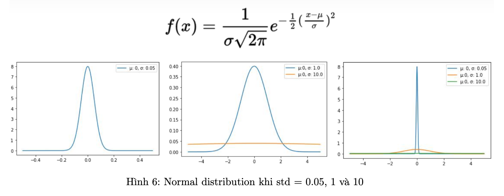

## VANISHING GRADIENT MLP

### Giới thiệu về project Vanishing Gradient MLP :

Project xoay quanh việc khắc phục vấn đề vanishing gradient trong mạng MLP khi thực hiện train một model quá sâu (có nhiều hidden layer). Sẽ có 6 phương pháp khác nhau tác động vào model, chiến thuật train, ... để giúp giảm thiểu vanishing gradients được giới thiệu trong project.

**1. Vanishing gradients Là Gì?**: Khi muốn tăng khả năng học một tập data lớn phức tạp hoặc trích xuất được nhiều đặc trưng phức tạp hơn, thông thường chúng ta sẽ tăng capacity của model bằng cách thêm vào nhiều layer hơn (model sâu hơn). Tuy nhiên, có một vấn đề xảy ra khi train model quá sâu là gradient bị giảm đi rất nhanh qua từng layer ở giai đoạn backpropagation. Dẫn đễn ít hoặc không có tác động vào weight sau mỗi lần update weight và làm cho model dường như không học được gì. Vấn đề này được gọi là vanishing gradients

**2. Dấu Hiệu Vanishing:**
• Weights của các layer gần output layer thay đổi rất nhiều, trong khi weight của các layer
gần input layer thay đổi rất hoặc hầu như không thay đổi
• Weights có thể tiệm cận 0 trong quá trình train
• Model học với tốc độ rất chậm và quá trình train có thể bị đình trệ rất sớm chỉ ở vài epoch đầu tiên
• Distribution của weight phần lớn xoay quanh 0

**3. Nguyên Nhân Vanishing:** Nguyên nhân là khi thực hiện backpropagation sẽ sử dụng chain rule, tức là tích gradient của các layer từ output layer đến layer hiện tại. Do đó gradient của các layer càng gần input càng rất nhỏ và gần như bằng 0 khi model quá sâu (tích của các số < 1 thì sẽ rất nhỏ, phần lớn là do các activation function dễ bị rơi vào vùng saturate như Sigmoid) . Gradient là thông tin để update các weight trong quá trình train, nếu gradient quá nhỏ hoặc bằng 0 thì weights gần như không thay đổi dẫn đến việc model không học được bất cứ thông tin gì từ data.

**4. Cách khắc phục:** Project này sẽ giới thiệu 6 cách giảm thiểu vấn đề vanishing: Weight increasing, Better activation, Better optimizer, Normalize inside network, Skip connection, Train some layers.

#### Mô tả Project

**1. Dataset** : Fashion MNIST data

**2. Giới thiệu vấn đề:** 

Chúng ta sẽ sử dụng tập data Fashion MNIST và xây dựng một model MLP để phân loại 10 classes trên tập data này. Tuy nhiên việc lựa chọn các tham số phù hợp để xây dựng model phù hợp với data là không dễ dàng và chúng ta sẽ đối mặt với nhiều vấn đề cần giải quyết để train được một model mong muốn. Project hiện tại sẽ xoay quanh một trong những vấn đề quan trọng và ảnh hưởng rất nhiều lên hiệu quả của việc training là Vanishing Problem.

Về lý thuyết khi ta xây dựng model càng deep (nhiều hidden layer) thì khả năng học và biểu diễn data của model sẽ tốt hơn so với các model ít layer hơn, nhưng trong thực tế đôi khi kết quả thì ngược lại. Ví dụ ta sẽ train tập Fashion MNIST với 3 model giống nhau hoàn toàn chỉ khác nhau về số lượng hidden layers (số lượng layer tăng dần) và quan sát kết quả của các model sau train được đánh giá trên tập test:

**→ Nhiệm vụ của các bạn trong project này là sẽ tìm các biện pháp khắc phục Vanishing problem khi sử dụng tập data Fashion MNIST trên Model 3**

**3. Giới thiệu project:**

(a) Tổng quát In/Out pipeline: Mục tiêu của project là sử dụng cá phương pháp giảm thiểu vấn đề vanishing và giúp model học tốt hơn. Chúng ta cần tinh chỉnh và thay đổi tham số hoặc đưa ra chiến thuật training hợp lý để vượt qua được vấn đề này

(b) Các cách giải quyết vấn đề: Trong project này các bạn sẽ được giới thiệu 6 phương pháp để giảm thiểu vanishing:

    i. Weight Increasing: Đối với model 3 việc khởi tạo weights hiện tại với mean = 0, và std (standard deviation)= 0.05 (mặc định của Tensorflow khi dùng RandomNormal) thì std chưa phù hợp và quá nhỏ. Điều này làm cho weight khởi tạo rất nhỏ (không đủ lớn) và dẫn đến vấn đề vanishing. Do đó, để giảm thiểu vanishing ta cần tăng std (tương đương tăng variance) trong một mức độ phù hợp. Hình dưới là mình họa std = 0.05, 1 và 10

    ii. Better Activation: Một trong những nguyên nhân dân đến vấn đề vanishing là do sử dụng Sigmoid activation function ở các hidden layer. Dó đó ta có thể thay đổi activation khác, cái mà derivative của nó tốt hơn so với sigmoid ví dụ Tanh hoặc ReLu. 

    iii. Better Optimizer: Hiện tại đang sử dụng stochastic gradient descent (SGD) và learning rate là một hằng số cố định sau mỗi lần train. Project này sẽ sử dụng optimizer khác cụ thể là Adam optimizer để thử nghiệm giảm thiểu vấn đề của vanishing. Adam (Adaptive Moment Estimation) là thuật toán tương tự như SGD dùng cho việc update weights của model dựa trên training data. Learning rate sẽ được coi như là một tham số (không còn là một constant như SGD) và mỗi larning rate khác nhau sẽ được áp dụng cho mỗi weight dựa vào β1 (first moment của gradient) và β2 (second moment của gradiend).

    iv. Normalize Inside Network: Là một kỹ thuật normalize để scale input theo một tiêu chí nhất định giúp cho việc optmize dễ dàng hơn bằng cách làm mịn loss surface của network, và có thể thể hiện như một layer trong network nên được gọi là Normalization layers. Trong project này sẽ giới thiệu giải pháp về vấn đề vanishing dựa trên kỹ thuật này được gọi là Batch Normalization, ngoài ra project cũng hướng dẫn các bạn custom layer để thực hiện normalize của riêng mình. Batch normalization sẽ normalize x để đảm bảo rằng x sẽ luôn tròng vùng có đạo hàm tốt (hình 10 vùng màu đỏ nhạt), do đó một phần giúp cho việc giảm thiểu được vấn đề vanishing

    v. Skip Connection: Với kiến trúc như các model truyền thống, nhưng sẽ có thêm những path truyền thông tin khác. Thay vì chỉ có một path đi qua từng layer một, thì phương pháp Skip Connection sẽ có thêm các path bỏ qua (skip) một số layer và connect với layer ở phía sau (hình 11) (cụ thể project sé sử dụng residual connections). Phương pháp này có thể giúp khắc phục được vấn đề vanishing, do nhờ có residual connection path mà gradient từ các layer ở gần output layer có thể truyền đến các layer ở gần input layer trong trường hợp gradient không thể truyền theo path đi qua từng layer một.

    vi. Train Some Layers: Dựa trên việc model quá sâu sẽ dẫn đến việc vanishing do không truyền được thông tin của gradient để model update weight. Do đó, chiến thuật này sẽ chia model gồm n hidden layer thành m model con có số lượng layer tương ứng . Tiếp theo, ta sẽ thực hiện n lần train bằng cách chồng chất các model con này và kết hợp với việc luân phiên freeze (fix, weights không được update trong quá trình train) và unfreeze (weights được update trong quá trình train) weights của các model con

