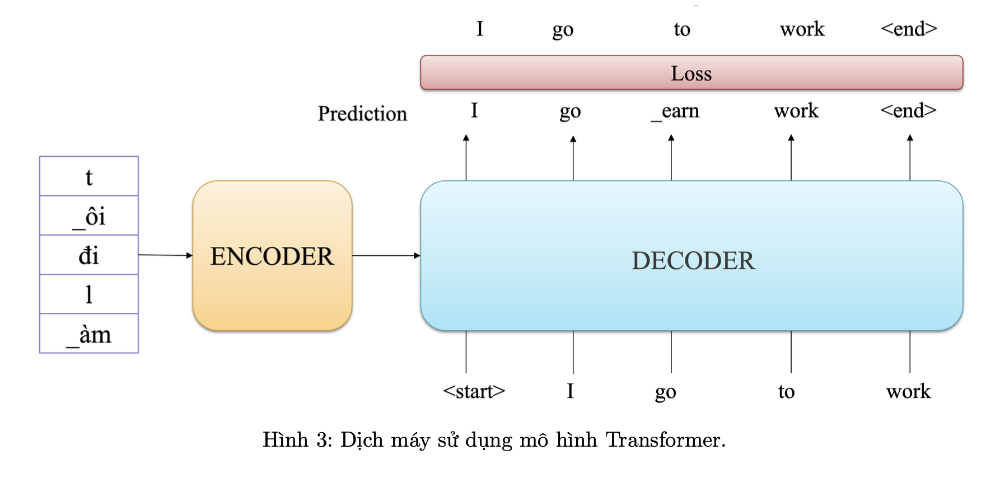
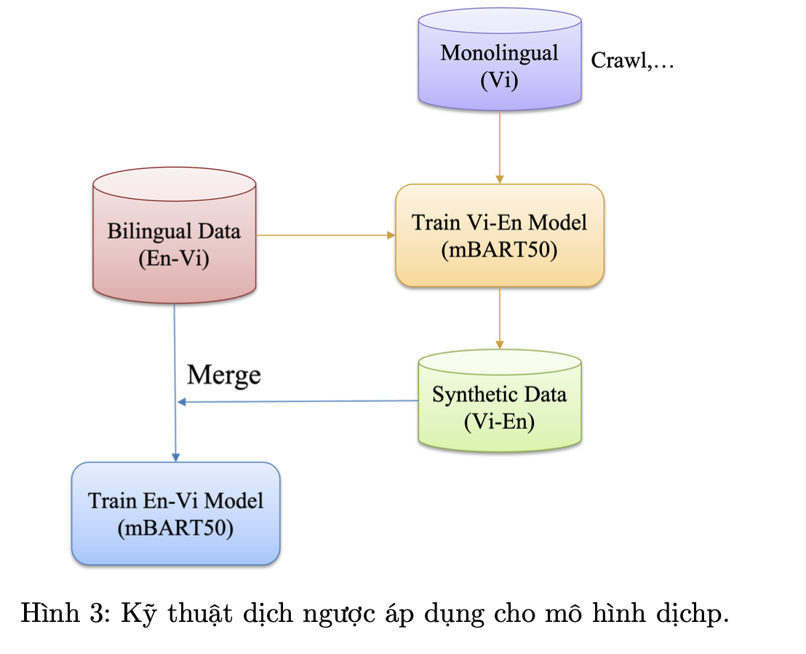
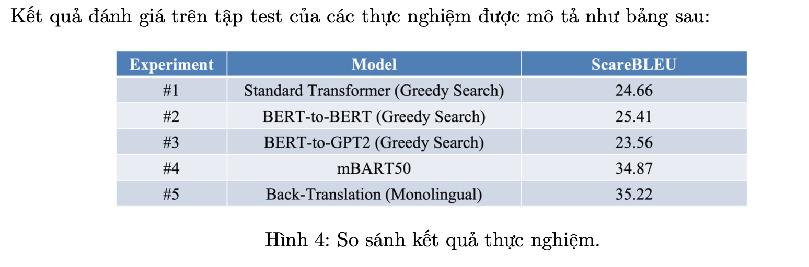

## Neural Machine Translation(Vi-En Translation)

#### Giới thiệu về project Neural Machine Translation(Vi-En Translation):

Dịch Máy (Machine Translation) với mục đích tự động dịch văn bản hoặc lời nói từ ngôn ngữ tự nhiên này sang ngôn ngữ tự nhiên khác. Dịch máy sử dụng kết hợp nhiều ý tưởng và các kỹ thuật với nhau từ ngôn ngữ học, khoa học máy tính, xác suất thống kê và trí tuệ nhân tạo. Với mục tiêu của dịch máy là phát triển một hệ thống cho phép tạo ra bản dịch chính xác giữa các ngôn ngữ tự nhiên của con người.

Các hệ thống dịch máy điển hình hiện này như: Google Translate, Bing Translator,... đã đạt được chất lượng bản dịch tốt và được tích hợp trong nhiều nền tảng ứng dụng khác nhau và có thể dịch tốt giữa hơn 100 các ngôn ngữ tự nhiên.

Như vậy, Input/Output của bài toán là:

• Input: Văn bản đầu vào của ngôn ngữ nguồn.
VD: Câu đầu vào tiếng việt: "Tôi đang học NLP"

• Output: Văn bản được dịch sang ngôn ngữ đích.
VD: Câu được dịch sang tiếng anh: " I am learning NLP"

Mô hình hoá bài toán dịch máy, với mục tiêu là huấn luyện và tối ưu các tham số mô hình $\theta$ với đầu vào văn bản từ ngôn ngữ nguồn $w^{(s)}$ và đầu ra văn bản từ ngôn ngữ đích tuơng ứng $w^{(s)}$:
$$\hat w^{(t)} = \argmax_{w^{(t)}}\theta(w^{(s)}, w^{(t)})$$

Vì vậy, để giải quyết tốt bài toán dịch máy, chúng ta cần quan tâm tối ưu:

• Phần 1: Thuật toán học tối ưu bộ tham số θ

• Phần 2: Thuật toán giải mã (decoding) để sinh ra bản dịch tốt nhất cho văn bản đầu vào

Hiện nay, có ba hướng tiếp cận chính cho bài toán này:

• Hướng 1: Dịch máy dựa vào luật (Rule-based Machine Translation - RBMT)

• Hướng 2: Dịch máy dựa vào thống kê (Statistical Machine Translation - SMT)

• Hướng 3: Dịch máy dựa vào mạng nơ-ron (Neural Machine Translation - NMT)

Trong các hướng tiếp cận này NMT đang ngày càng phát triển và cho chất lượng bản dịch tốt vượt trội. Vì vậy, phạm vi project tập trung vào các phương pháp dựa trên mạng nơ-ron gồm 2 nội dung chính:

• Phương pháp 1: Xây dựng mô hình dịch máy sử dụng kiến trúc Transformer

• Phương pháp 2: Xây dựng mô hình dịch máy sử dụng Pre-trained Language Model như BERT và GPT

Một trong những thách thức lớn hiện nay của các hệ thống dịch là có ít tài nguyên để huấn luyện mô hình. Vì vậy, trong phần này, chúng ta sẽ tập trung vào cải thiện các mô hình dịch với ít tài nguyên (Low-resource machine translation), số lượng các cặp dữ liệu song ngữ hạn chế, ví dụ mô hình dịch huấn luyện với chỉ 20000 cặp câu tiếng anh và tiếng việt. Vì vậy, để cải tiến mô hình dịch trong trường hợp có ít tài nguyên, chúng ta tập trung vào 2 hướng tiếp cận như sau:

1. Hướng 1: Sử dụng mô hình pre-trained mBART50

2. Hướng 2: Sử dụng kỹ thuật dịch ngược (Back-translation) để tăng cường dữ liệu

### Cài đặt chương trình
#### Transformer-Based

1. Dataset : IWSLT’15 English - Vietnamese Dataset

2. Processing Data
    + Tokenization

3. Xây dựng mô hình Transformer
    

4. Training
    + Loss Function : CrossEntropy 
    + Greedy Decode
5. Evaluation
    + Metrics : BLUE scores

#### Pretrained LLMs

Sẽ sử dụng các pre-trained LMs model là BERT và GPT2 để khởi tạo cho Transformer thông qua thư viện "transformers" của huggingface. Gồm có 2 cách chính:

• Cách 1: BERT cho Transformer-Encoder và BERT cho Transformer-Decoder 

• Cách 2: BERT cho Transformer-Encoder và GPT2 cho Transformer-Decoder

### Low-resource 

#### Pre-trained mBART50

Để xây dựng, đánh giá hiệu suất các mô hình chúng ta sử dụng bộ dữ liệu dịch IWSLT’15 English -Vietnamese với số lượng mẫu cho training: 133,317 cặp câu song ngữ, tập validation: 1,553 cặp câu song ngữ và tập test: 1,269 cặp câu song ngữ. Chiều dịch sẽ từ tiếng anh sang tiếng việt.
Metric để đánh giá chúng ta sử dụng: ScacreBleu (BLEU)
Trong phần này, chúng ta sẽ sử dụng kỹ thuật fine-tuning để huấn luyện mô hình dịch theo chiều EN-VI.

#### Back-Translation

Kỹ thuật dịch ngược bao gồm các bước sau:

• Bước 1: Xây dựng bộ dữ liệu đa ngữ (Monolingual data) dành cho tiếng việt.

• Bước 2: Huấn luyện mô hình mBART50 với chiều dịch là Việt - Anh.

• Bước 3: Tạo bộ dữ liệu tổng hợp sử dụng mô hình mBART50 Vi-En trên bộ dữ liệu đơn ngữ

• Bước 4: Kết hợp bộ dữ liệu tổng hợp với bộ dữ liệu gốc để huấn luyện mô hình En-Vi.

**Dataset** : Bộ dữ liệu đơn ngữ dành cho Tiếng Việt [PhoMT](https://drive.google.com/file/d/1DKXOoloeU8BOjrf8tebtMcdzbKEpe7wq/view)

