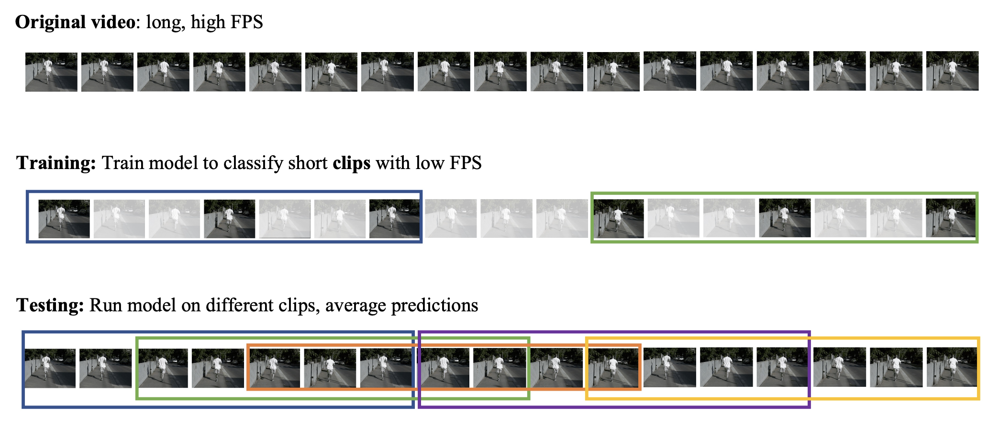
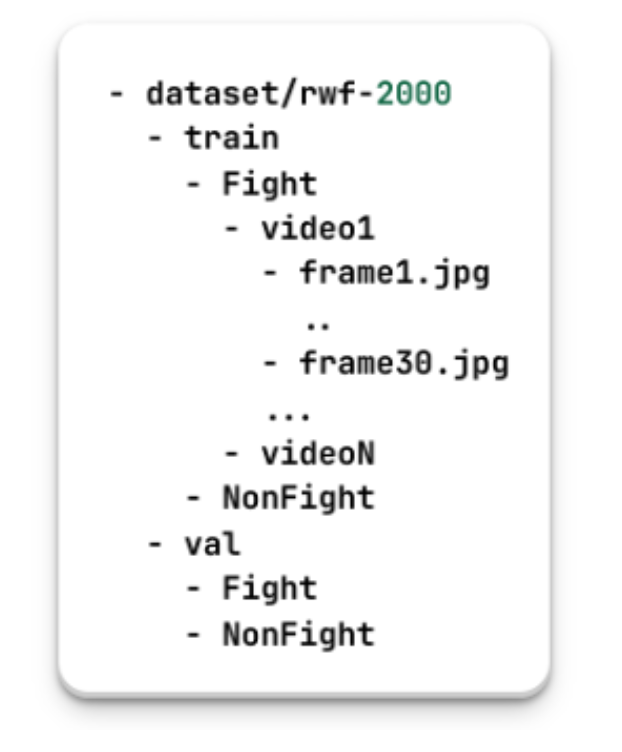

## Video Classification Project

#### Giới thiệu về project Video Classification Project:

`Video Classificaition` tập trung vào việc áp dụng và phát triển các mô hình học sâu để tự động phân loại video dựa trên nội dung hình ảnh được chứa đựng. Project này khai thác sâu vào các dữ liệu video, từ việc xử lý, phân loại đến nhận diện các hành vi trong các tình huống cụ thể như bạo lực, thông qua việc sử dụng các mô hình tiên tiến như 3D CNNs, CNN-LSTM, và mới nhất là Video Vision Transformer (ViViT).

**Dataset**

Dữ liệu được sử dụng trong dự án này là bộ [RWF2000](https://github.com/mchengny/RWF2000-Video-Database-for-Violence-Detection), tập trung vào nhận diện hành vi bạo lực từ các video giám sát, bao gồm 2000 clip ngắn, mỗi clip kéo dài 5 giây với độ phân giải 30 khung hình/giây. Các video được xử lý và huấn luyện trong các môi trường khác nhau để đối phó với các thách thức như độ phân giải thấp và biến động nhanh của các đối tượng trong video.

Cấu trúc dataset

**Model**

Các mô hình được khai thác bao gồm:

+ Single-frame CNN: Phương pháp cơ bản nhất, sử dụng mô hình 2D CNN để xử lý từng khung hình một cách độc lập.

+ Late Fusion và Early Fusion: Các kỹ thuật này tổng hợp các đặc trưng từ nhiều khung hình để cải thiện độ chính xác của phân loại.

+ CNN-LSTM: Kết hợp CNN với LSTM để xử lý thông tin về thời gian qua các khung hình.

+ CNN-Mamba: Kết hợp CNN với Mamba. Tận dụng khả năng vượt trội của Mamba để xử lý thông tin về thời gian qua các khung hình.

+ 3D CNN: Mô hình sử dụng cả không gian và thời gian để nhận diện mô hình hành vi một cách hiệu quả hơn.

+ Video ViT (ViViT): Sử dụng kiến trúc Transformer mới nhất cho video, giúp cải thiện đáng kể khả năng nhận diện và phân loại video.
