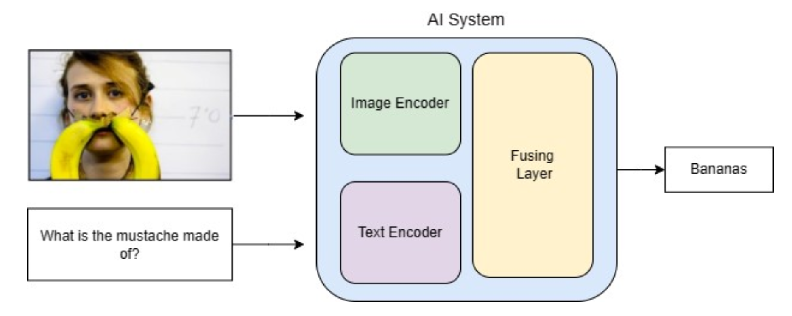
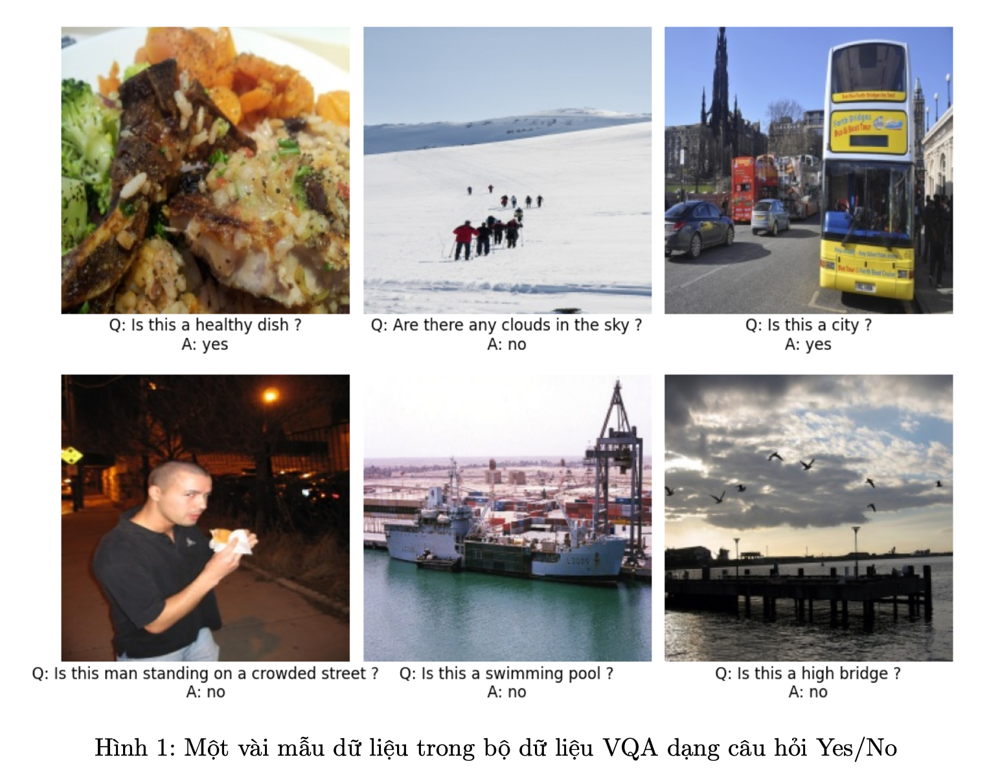

## Visual Question Answering

#### Giới thiệu về project Visual Question Answering :

`Visual Question Answering (VQA)` là một bài toán phổ biến trong Machine Learning, ứng dụng các kĩ thuật liên quan từ hai lĩnh vực Computer Vision và Natural Language Processing. Khái niệm cốt lõi của bài toán này là phân tích một hình ảnh và trả lời câu hỏi về hình ảnh đó. Bước đầu là phân tính thông tin đầu vào, bao gồm sử dụng các kĩ thuật xử lý hình ảnh và xử lý câu hỏi đặt ra bằng ngôn ngữ tự nhiên. Sau đó, hệ thống VQA sẽ hợp thông tin thu được từ phân tích hình ảnh và ngữ cảnh của câu hỏi để tạo ra một câu trả lời phù hợp. Vì vậy, một chương trình có độ chính xác cao cần xây dựng tốt cả hai thành phần này, đặt ra thách thức rất lớn trong việc giải quyết tốt bài toán hỏi đáp với ảnh.

Trong project này, chúng ta sẽ xây dựng một chương trình VQA sử dụng mô hình CNN cho hình ảnh và LSTM cho xử lý ngôn ngữ. Input và output của chương trình như sau:

• Input: Một cặp hình ảnh và câu hỏi bằng ngôn ngữ tự nhiên. 

• Output: Câu trả lời cho câu hỏi về hình ảnh.

#### Cài đặt chương trình
1. Dataset : [vqa_coco_dataset](https://drive.google.com/file/d/1kc6XNqHZJg27KeBuoAoYj70_1rT92191/view)

2. Mô hình
    + CNN (Image Encoder) + LSTM(Text Encoder) -> Classifier(LSTM)
    + VisionTransformer (Image Encoder) + RoBERTa (Text Encoder) -> Classifier(LSTM):
    + VisionTransformer (Image Encoder) + RoBERTa (Text Encoder) -> Classifier(MLP): 

    + Loss function : CrossEntropy

3. Evaluation
    + Metrics : Accuracy